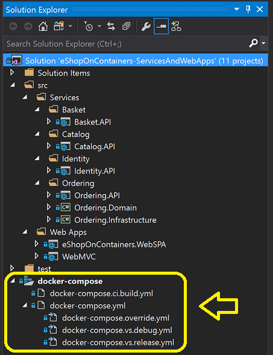
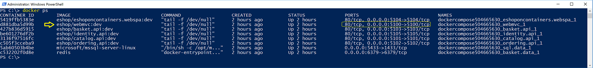
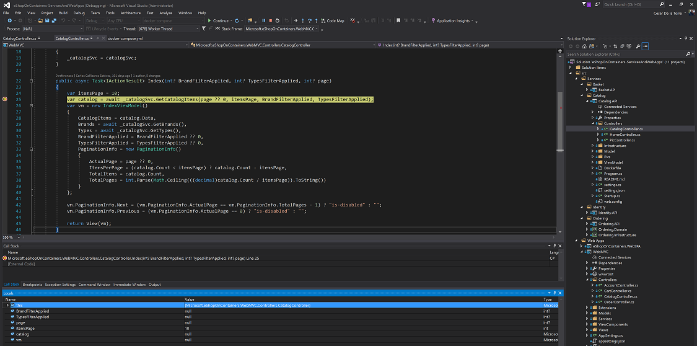
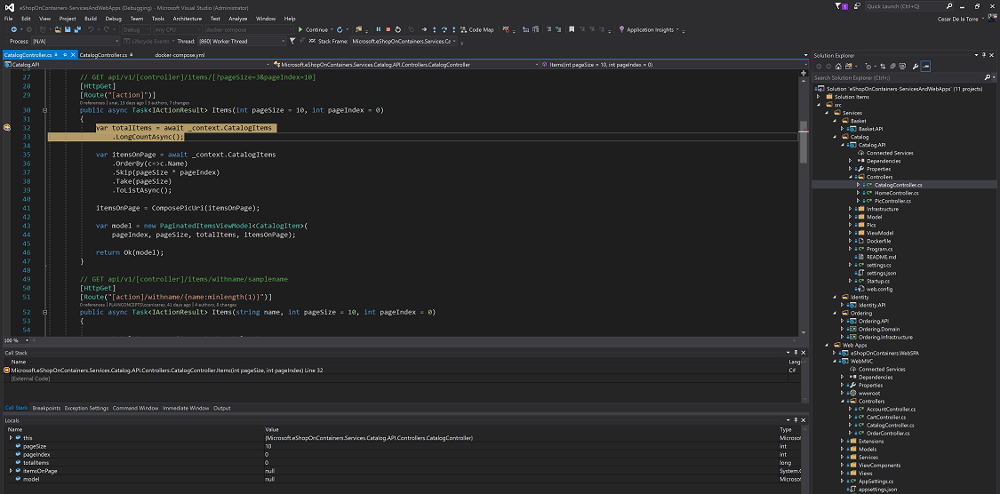
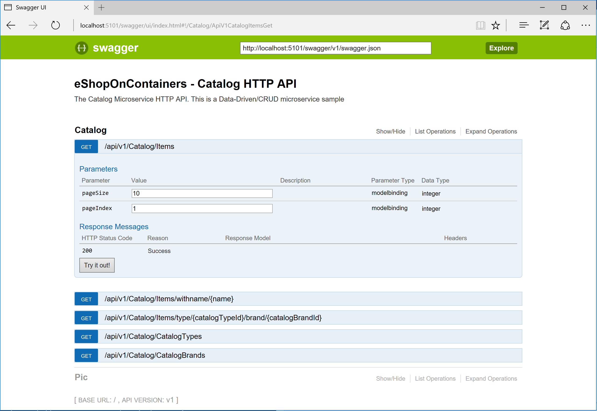

## Setting eShopOnContainers up in a Visual Studio 2017 development machine
Visual Studio 2017 with its built-in Docker Tools adds a number of very convenient features which are solid reasons why you'd want to use VS 2017 when developing Docker container based applications. The most important features are:
* Multi-container debugging, supporting true microservice scenarios
* Windows Server Containers for .NET Framework apps
* Addition of CI build definition using a docker-compose.ci.build.yml file at the solution level.
* Configure Continuous Integration experience for setting up CI/CD with VSTS to Azure Container Services

Being the first one (Multi-container debugging, supporting true microservice scenarios) the most loved feature, probably.
So, here's how to setup a VS 2017 environment where you can test eShopOnContainers.

### GitHub branch to use
By default, use the MASTER branch which supports .CSPROJ and VS 2017.

### Software requirements
Software installation requirements for a Windows dev machine with Visual Studio 2017 and Docker for Windows:
- <a href='https://docs.docker.com/docker-for-windows/install/'>Docker for Windows</a> with the concrete configuration specified below.
- <a href='https://www.visualstudio.com/vs/'>Visual Studio 2017</a> (Latest version) with the workloads specified below.
- NPM and related dependencies for running the SPA Web app. <a href='https://github.com/dotnet/eShopOnContainers/wiki/06.-Setting-the-Web-SPA-application-up'>Setup process described here </a> 

### Installing and configuring Docker in your development machine

#### Install Docker for Windows
Install Docker for Windows (The Stable channel should suffice) from this page: https://docs.docker.com/docker-for-windows/install/
About further info on Docker for windows, check this additional page
https://docs.docker.com/docker-for-windows/ 

Docker for Windows uses Hyper-V to run a Linux VM which is the by default Docker host. If you don't have Hyper-V installed/enabled, it'll be installed and you will probably need to reboot your machine. Docker's setup should warn you about it, though.

**IMPORTANT**: Check that you don't have any other hypervisor installed that might be not compatible with Hyper-V. For instance, Intel HAXM can be installed by VS 2017 if you chose to install Google's Android emulator which works on top of Intel HAXM. In that case, you'd need to uninstall Google's Android emulator and Intel HAXM.
VS 2017 recommends to install the Google Android emulator because it is the only Android emulator with support for Google Play Store, Google Maps, etc. However, take into account that it currently is not compatible with Hyper-V, so you might have incompatibilities with this scenario.

#### Set needed assigned Memory and CPU to Docker
For the development environment of eShopOnContainers, by default, it runs 1 instance of SQL Server running as a container with multiple databases (one DB per microservice), other 6 additional ASP.NET Core apps/services each one running as a container, plus 1 Redis server running as a container. Therefore, especially because of the SQL Server requirements on memory, it is important to set Docker up properly with enough memory RAM and CPU assigned to it or you will get errors when starting the containers with VS 2017 or "docker-compose up".

Once Docker for Windows is installed in your machine, enter into its Settings and the Advanced menu option so you are able to adjust it to the minimum amount of memory and CPU (Memory: Around 4096MB and CPU:3) as shown in the image. Usually you might need a 16GB memory machine for this configuration if you also want to run the Android emulator for the Xamarin app or multiple instances of applications demanding significant memory at the same time. If you have a less powerful machine, you can try with a lower configuration and/or by not starting certain containers like the basket and Redis. But if you don't start all the containers, the application will not fully function properly, of course. 

#### Share drives in Docker settings (In order to deploy and debug with Visual Studio 2017)
(Note, this is not required if running from Docker CLI with docker-compose up and using VS 2015 or any other IDE or Editor)

In order to deploy/debug from Visual Studio 2017, you'll need to share the drives from Settings-> Shared Drives in the "Docker for Windows" configuration.
If you don't do this, you will get an error when trying to deploy/debug from VS 2017, like "Cannot create container for service yourApplication: C: drive is not shared". 

The drive you'll need to share depends on where you place your source code.

### IMPORTANT: Open ports in Firewall so Authentication to the STS (Security Token Service container) can be done through the 10.0.75.1 IP which should be available and already setup by Docker
- You can manually create a rule in your local firewall in your development machine or you can also create that rule by just executing the <b>add-firewall-docker.ps1</b> script in the solution's root folder. 
- Basically, you need to open the ports 5100 to 5105 that are used by the solution by creating an IN-BOUND RULE in your firewall, as shown in the screenshot below (for Windows).
 

### Installing and configuring Visual Studio 2017 in your development machine

#### Install Visual Studio 2017
Once you have the bits downloaded locally, run the VS 2017 setup file and select the following workloads depending on the apps you intend to test or work with:

##### Working only with the server side (Microservices and web applications) - Workloads

- ASP.NET and web development
- .NET Core cross-platofrm development
- Azure development (Optional) - It is optional but recommended in case you want to deploy to Docker hosts in Azure or use any other infrastructure in Azure.

##### Working with the mobile app (Xamarin Mobile apps for iOS, Android and Windows UWP) - Workloads
If you also want to test/work with the eShopOnContainer model app based on Xamarin, you need to install the following additional workloads:
- Mobile development with .NET (Xamarin)
- Universal Windows Platform development
- .NET desktop development (Optional) - This is not required, but just in case you also want to make tests consuming the microservices from WPF or WinForms desktop apps

IMPORTANT: As mentioned above, make sure you are NOT installing Google's Android emlulator with Intel HAXM hypervisor or you will run on an incompatibility and Hyper-V won't work in your machine, therefore, Docker for Windows wont work when trying to run the Linux host or any host witih Hyper-V. 

Make sur eyou are NOT selecting
the highlighted options below with a red arrows:

### Clone the eShopOnContainers code from GitHub
**As of February 2017**, the branch to clone/download from GitHub compatible with Visual Studio 2017 is the branch named **vs2017**:

So make sure you switch to that branch in VS 2017 after cloning or clone that beanch with a Git command, from command prompt or PowerShell, similar to:

    git clone -b vs2017 https://github.com/dotnet/eShopOnContainers.git

### Open eShopOnContainers solution, Build, Run

#### Open eShopOnContainers solution in Visual Studio 2017

- If testing/working only with the server-side applications and services, open the solution: **eShopOnContainers-ServicesAndWebApps.sln**

- If testing/working either with the servier-side applications and services plus the Xamarin mobile apps, open the solution: **eShopOnContainers.sln**

Below you can see the full **eShopOnContainers-ServicesAndWebApps.sln** solution (server side) opened in Visual Studio 2017:

Note how VS 2017 loads the docker-compose.yml files in a special node-tree so it uses that configuration to deploy/debug all the containers configured, at the same time into your Docker host.

#### Build the Web SPA application with NPM
If you want to run/test the web eShopOnContainers SPA (Single Page Application) client in adition to the regular MVC Web app, you need to install certain dependencies for the client side and build it with "npm build", as the client side of the SPA app is based on ANGULAR 2, TypeScript and other JS frameworks and compilation that needs to happen before building the Docker images. 
The process is described in detail here: 
https://github.com/dotnet/eShopOnContainers/wiki/06.-Setting-the-Web-SPA-application-up

Come back to this point when you finished with the "Setting the SPA up" process.

#### Build and run eShopOnContainers from Visual Studio 2017

##### Set docker-compose as the default StartUp project
In case it is not your "by default project", right click on the "docker-compose" node and select the "Set as Startup Project" menu option, as shwon below:

At this point, after waiting sometime for the Nuget packages to be properly restored, you should be able to build the whole solution or even directly deploy/debug it into Docker by simple hitting F5 or pressing the debug "Play" button that now should be labeled as "Docker": 

VS 2017 should compile the .NET projects, then create the Docker images and finally deploy the containers in the Docker host (your by default Linux VM in Docker for Windows). 
Note that the first time you hit F5 it'll take more time, a few minutes at least, because in addition to compile your bits, it needs to pull/download the base images (SQL for Linux Docker Image, Redis Image, ASPNET image, etc.) and register them in the local image repo of your PC. The next time you hit F5 it'll be much faster.

Finally, because the docker-compose configuration project is configured to open the MVC application, it should open your by default browser and show the MVC application with data coming from the microservices/containers:

Here's how the docker-compose configuration project is configured to open the MVC application:

Finally, you can check out how the multiple containers are runnin in your Docker host by running the command **"docker ps"** like below:

You can see the 8 containers are running and what ports are being exposed, etc.

### Debug with several breakpoints across the multiple containers/projects

Something very compelling and productive in VS 2017 is the capability to debug several breakpoints across the multiple containers/projects.
For instance, you could set a breakpoint in a controller within the MVC web app plus a second breakpoint in a second controller within the Catalog Web API microservice, then refresh the browser if you were still running the app or F5 again, and VS will be stopping within your microservices running in Docker as shown below! :)

Breakpoint at the MVC app running as Docker container in the Docker host:

Press F5 again...

Breakpoint at the Catalog microservice running as Docker container in the Docker host:

And that's it! Super simple! Visual Studio is handling all the complexities under the covers and you can directly do F5 and debug a multi-container application! 

### Test the SPA Web app
While having the containers running, open a browser and type `http://localhost:5104/` and hit enter.
You should see the SPA application like in the following screenshot:

 

### Test a microservice's Swagger interface (i.e. the Catalog microservice)
While having the containers running, open a browser and type `http://localhost:5101` and hit enter.
You should see the Swagger page for that microservice that allows you to test the Web API, like in the following screenshot:

Then, after providing the size (i.e. 10) and the current page (i.e. 1) for the data of the catalog, you can run the service hitting the "Try it out!" button and see the returned JSON Data:

 

----

### Testing all the applications and microservices
Once the containers are deployed, you should be able to access any of the services in the following URLs or connection string, from your dev machine:

- Web MVC: <a href="http://localhost:5100" target="top">http://localhost:5100</a>
- Web Spa: <a href="http://localhost:5104" target="top">http://localhost:5104</a> (Important, check how to set up the SPA app and requirements before building the Docker images. Instructions at  https://github.com/dotnet/eShopOnContainers/tree/master/src/Web/WebSPA/eShopOnContainers.WebSPA or the README.MD from eShopOnContainers/src/Web/WebSPA/eShopOnContainers.WebSPA)
- Catalog microservice: <a href="http://localhost:5101" target="top">http://localhost:5101</a> (Not secured)
- Ordering microservice: <a href="http://localhost:5102" target="top">http://localhost:5102</a> (Requires token for authorization)
- Basket microservice: <a href="http://localhost:5103" target="top">http://localhost:5103</a> (Requires token for authorization)
- Identity microservice: <a href="http://localhost:5105" target="top">http://localhost:5105</a>
- Orders database (SQL Server connection string): Server=tcp:localhost,5432;Database=Microsoft.eShopOnContainers.Services.OrderingDb;User Id=sa;Password=Pass@word;
- Catalog database (SQL Server connection string): Server=tcp:localhost,5434;Database=CatalogDB;User Id=sa;Password=Pass@word
- ASP.NET Identity database (SQL Server connection string): Server=localhost,5433;Database=aspnet-Microsoft.eShopOnContainers;User Id=sa;Password=Pass@word
- Basket data (Redis): listening at localhost:6379
 
#### Creating and Order and Authenticating on the Web MVC application with the DemoUser@microsoft.com user account
When you try the Web MVC application by using the url http://localhost:5100, you'll be able to test the home page which is also the catalog page. But if you want to add articles to the basket you need to login first at the login page which is handled by the STS microservice/container (Security Token Service). At this point, you could register your own user/customer or you can also use a convenient default user/customer named **demoUser@microsoft.com** so you don't need to register your own user and it'll be easier to test.
The credentials for this demo user are:
- User: **demouser@microsoft.com**
- Password: **Pass@word1**

Below you can see the login page when providing those credentials.

#### Trying the Xamarin.Forms mobile apps for Android, iOS and Windows
You can deploy the Xamarin app to real iOS, Android or Windows devices.
You can also test it on an Android Emulator based on Hyper-V like the Visual Studio Android Emulator (Do NOT install the Google's Android emulator or it will break Docker and Hyper-V, as mentioned aboce).

By default, the Xamarin app shows fake data from mock-services. In order to really access the microservices/containers in Docker from the mobile app, you need to:
 - Disable mock-services in the Xamarin app by setting the <b>UseMockServices = false</b> in the App.xaml.cs and specify the host IP in  BaseEndpoint = "http://10.106.144.28" at the GlobalSettings.cs. Both files in the Xamarin.Forms project (PCL).
 - Another alternative is to change that IP through the app UI, by modifying the IP address in the Settings page of the App as shown in the screenshot below. 
- In addition, you need to make sure that the used TCP ports of the services are open in the local firewall. 

