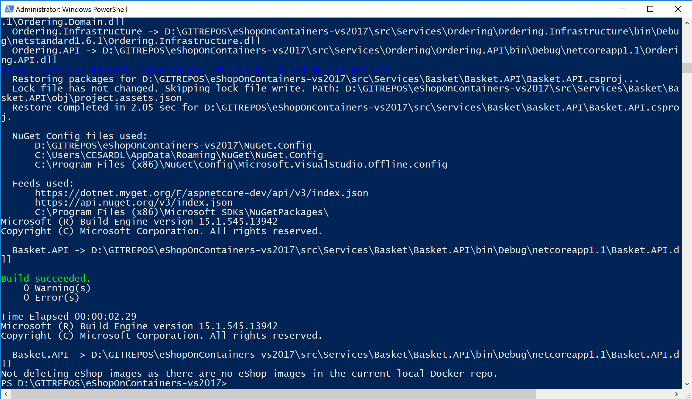
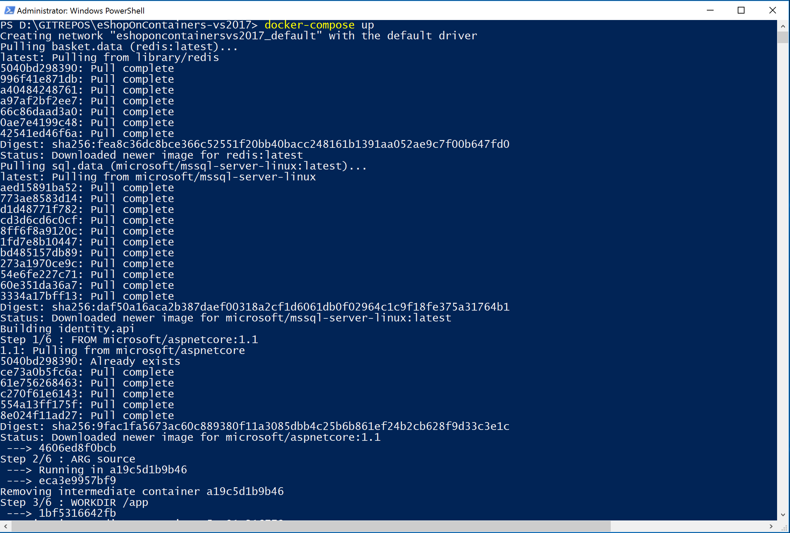
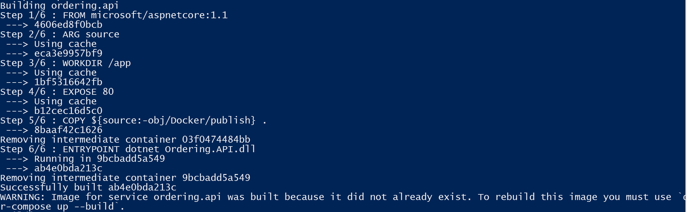
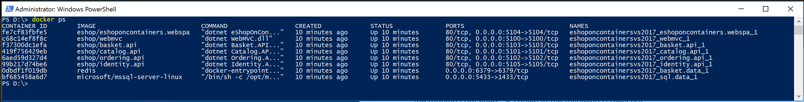
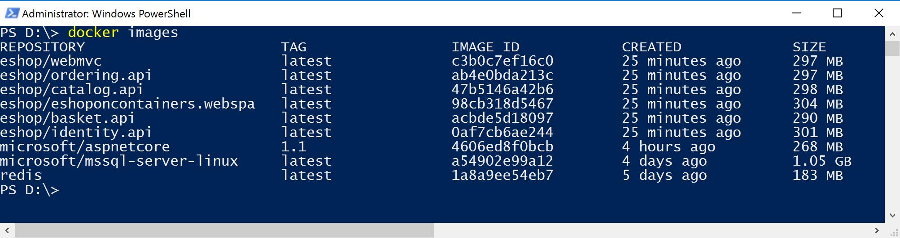
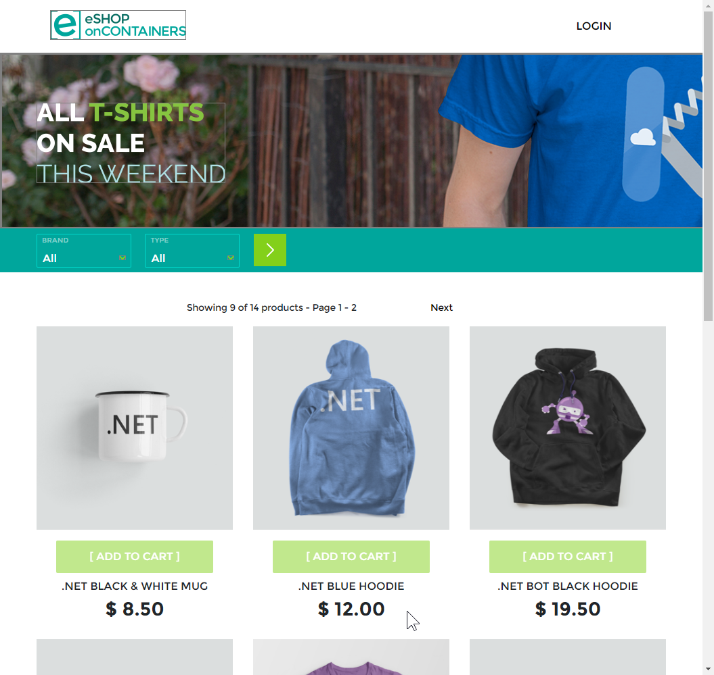
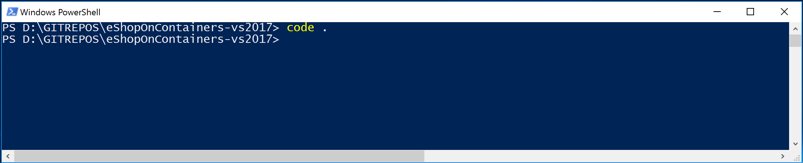
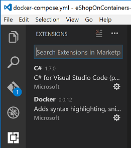

## Setting eShopOnContainers up in a CLI and Windows based development machine

### GitHub branch to use
As of February 20th, the branch to use with .NET Core CLI and Docker CLI with .CSPROJ projects support is the branch: vs2017 :
https://github.com/dotnet/eShopOnContainers/tree/vs2017  
(It is the same code than used with VS 2017)

### Software requirements
Software installation requirements for a Windows dev machine with CLI SDKs, Docker for Windows and Visual Studio Code or any other editor.

WINDOWS DEV MACHINE
- <a href='https://docs.docker.com/docker-for-windows/install/'>Docker for Windows</a>. Important, follow the concrete configuration specified in the steps below.
- <a href='https://www.microsoft.com/net/download/core#/current'>.NET Core SDK</a> - (Latest version. As of February 2017, using .NET 1.1 SDK)
- <a href='https://code.visualstudio.com/'>Visual Studio Code</a> or any other code editor.
- NPM and related dependencies for running the SPA Web app. <a href='https://github.com/dotnet/eShopOnContainers/wiki/06.-Setting-the-Web-SPA-application-up'>SPA app setup process described here </a> 

This environment means that you want to build/run by using the CLI (Command line interface plus PowerShell scripts and "docker-compose up/build" CLI).

Because in this environment you need to build the .NET projects from the dotnet CLI plus being able to build the docker images with docker-compose build, there are some SDKs that need to be available from the command line and you need to install and configure so commands are available from the cmd context.

## Setting up the development environment

### Installing and configuring Docker in your development machine

#### Install Docker for Windows
Install Docker for Windows (The Stable channel should suffice) from this page: https://docs.docker.com/docker-for-windows/install/
About further info on Docker for windows, check this additional page
https://docs.docker.com/docker-for-windows/ 

Docker for Windows uses Hyper-V to run a Linux VM which is the by default Docker host. If you don't have Hyper-V installed/enabled, it'll be installed and you will probably need to reboot your machine. Docker's setup should warn you about it, though.

**IMPORTANT**: Check that you don't have any other hypervisor installed that might be not compatible with Hyper-V. For instance, Intel HAXM can be installed by VS 2017 if you chose to install Google's Android emulator which works on top of Intel HAXM. In that case, you'd need to uninstall Google's Android emulator and Intel HAXM.
VS 2017 recommends to install the Google Android emulator because it is the only Android emulator with support for Google Play Store, Google Maps, etc. However, take into account that it currently is not compatible with Hyper-V, so you might have incompatibilities with this scenario.

#### Set needed assigned Memory and CPU to Docker
For the development environment of eShopOnContainers, by default, it runs 1 instance of SQL Server running as a container with multiple databases (one DB per microservice), other 6 additional ASP.NET Core apps/services each one running as a container, plus 1 Redis server running as a container. Therefore, especially because of the SQL Server requirements on memory, it is important to set Docker up properly with enough memory RAM and CPU assigned to it or you will get errors when starting the containers with VS 2017 or "docker-compose up".

Once Docker for Windows is installed in your machine, enter into its Settings and the Advanced menu option so you are able to adjust it to the minimum amount of memory and CPU (Memory: Around 4096MB and CPU:3) as shown in the image. Usually you might need a 16GB memory machine for this configuration if you also want to run the Android emulator for the Xamarin app or multiple instances of applications demanding significant memory at the same time. If you have a less powerful machine, you can try with a lower configuration and/or by not starting certain containers like the basket and Redis. But if you don't start all the containers, the application will not fully function properly, of course. 

#### Share drives in Docker settings (In order to deploy and debug with Visual Studio 2017)
(Note, this is not required if running from Docker CLI with docker-compose up and using VS 2015 or any other IDE or Editor)

In order to deploy/debug from Visual Studio 2017, you'll need to share the drives from Settings-> Shared Drives in the "Docker for Windows" configuration.
If you don't do this, you will get an error when trying to deploy/debug from VS 2017, like "Cannot create container for service yourApplication: C: drive is not shared". 

The drive you'll need to share depends on where you place your source code.

### IMPORTANT: Open ports in Firewall so Authentication to the STS (Security Token Service container) can be done through the 10.0.75.1 IP which should be available and already setup by Docker
- You can manually create a rule in your local firewall in your development machine or you can also create that rule by just executing the <b>add-firewall-docker.ps1</b> script in the solution's root folder. 
- Basically, you need to open the ports 5100 to 5105 that are used by the solution by creating an IN-BOUND RULE in your firewall, as shown in the screenshot below (for Windows).
 

### .NET Core SDK setup
You need the .NET Core SDK so you can run the .NET Core CLI with commands like "dotnet build", "dotnet publish", etc.

Install the .NET Core SDK from here 
https://www.microsoft.com/net/download/core#/current
(Current/x64 .NET Core 1.1 SDK Installer, usually)

Run the setup like in the following screenshot:
 

### Node, Bower and Gulp installation
Before building the .NET and JS bits, and specifically when generating the web apps binaries with "dotnet build" and "dotnet publish" from the custom scripts (like when running the build-bits.ps1 script from PowerShell), it needs to have access to the paths where you have installed Bower and Gulp. For that, the recommendation is to install Bower and Gulp with a global installation by running the following commands from command-line or bash:
- Install Node if you don't have it installed, from here: https://nodejs.org/en/ 
 
- NOTE: After installing Node, **if you are also using the full Visual Studio 2017**, you need to align that installed version with the version used by Visual Studio, so you need to make sure that VS2017 is using the same nodejs that you are using from command line. 
**Go to "Tools -> Options -> Project and Solutions -> Web Package Management -> External Web Tools"** and ensure that the nodejs you use from command line is listed before the entry "$(VSINSTALLDIR)\Web\External"
- Install Bower and Gulp with the following npm commands (npm is installed as part of Node)

    `npm install -g bower` 

    `npm install -g gulp`

Below you can see how those commands are run in Windows:

## Build, Ship, Run 
Within eShopOnContainers' root directory you will find the scripts needed to build the .NET bits of the application which under the covers are using the .NET Core CLI (dotnet). Afterwards, you'll be able to use "docker-compose up/build" to deploy to your local Docker host.  
The steps are the following: 

### Build the SPA web app Angular/TypeScript/JavaScript code
In order to build and test the SPA web app in addition to the regular MVC app and microservices, you need to follow the steps in this link before continuing:  
**Setting up the SPA web application**
https://github.com/dotnet/eShopOnContainers/wiki/06.-Setting-the-Web-SPA-application-up
 (You will only need to run these steps in the SPA link once, because the script below is also running the "npm build" command triggered by the .csproj file).

### Compile the .NET apps and publish the bits in the publish folders

These steps are easily performed by running a convenient script already created for you. As mentioned, it is internally using the .NET Core CLI (dotnet).
- Open a PowerShell window in Windows. Make sure that you have permission to run scripts by running the following command:
    `Set-ExecutionPolicy Unrestricted -Scope LocalMachine`
    

- There is a Power-Shell script that you will find in the <u>root directory of the solution</u> named <b>build-bits.ps1</b> which is responsible for building the .NET applications and copy the binaries into multiple publish folder.

    Move to the root folder of your solution (like yourPath\eShopOnContainers) and run the <b>build-bits.ps1</b> script file, which will compile the .NET Core projects and publish the bits in each project's publish folder within "project-folder\obj\Docker\publish" (per project), like in the following screenshots.

    PowerShell to run:
    

    Below you see the **build-bits.ps1** execution after compiling the .NET Core projects and publishing the bits into the publish folders:
    

    Note that this script will also delete previous eShop/* docker images and any container that you might have created in your local Docker repository, so afterwards when running "docker-compose up/build" it will start from a clean state in regards the eShop images.

    You can check how in every project, under the folder "project-folder\obj\Docker\publish" (per project) the script generated the bits/binaries to be packaged as a Docker image and deployed as a container, afterwards:

    

### Buil Images and Deploy containers into your Docker host
You can build the Docker images and deploy the containers to a regularDocker host by using the Docker CLI tool `docker-compose up` which is very convenient for multi-container applications as it can build all the Docker images for you and then spin-up all the multiple containers of your application, all with a single command.
If you don't want to deploy the containers but only build the images, you can do so by running `docker-compose build`
These are the steps:

- **Build images and run your containers in your local host:** Open your favorite command tool (PowerShell od CommandLine in Windows / Bash in Mac) <u> and move to the root directory of the solution</u> where the docker-compose.yml files are located and run the command `docker-compose up`. If this is the first time you run it, it will also build the docker images. Other than that, you could also force to build the images by running `docker-compose build` previously. 
When running `docker-compose up` you should see something similar to the following screenshot in the PowerShell command window, although it will much longer than that, building the images the first time and showing many internal SQL commands from the services when populating sample data for your application.

    `docker-compose up`
    

    Note that the first time you try to build any image or run any container (with docker run or docker-compose) it detects that it needs the base images you are using, like the SQL Server image and the Redis image, so it will pull or download those base images from the Internet, from the public repo at the Docker registry named DOCKER HUB, by pulling the "microsoft/mssql-server-linux" which is the base image for the SQL Server for Linux on containers, and the "library/redis" which is the base Redis image. Therefore, the first time you run docker-compose it might take a few minutes pulling those images before it spins up your custom containers.
    The next time you run docker-compose up, since it'll have those base images already pulled/downloaded, it will be much faster.

    Because in eShopOnContainers' docker-compose.yml files it is also specified to build the custom Docker images, it is building it, like in the screenshot below (part of the same command execution):
    

    Finally, you can see how the scripts waits after deploying all the containers:
    

- The next time you run "docker-compose up" again (you don't need to repeat it now), because now you already have all the base images downloaded and registered in your local repo and your custom images built and ready to go, it'll be much faster since it just needs to deploy the containers, like the following screenshot:

- <b>Check out the containers running in your Docker host</b>: Once docker-compose up finishes, you will have the original PowerShell window busy and showing the execution's output in a "wait state", so in order to ask to Docker about "how it went" and see what containers are running, you need to open a second PowerShell window and type "docker ps" so you'll see all the running containers, as shown in the following screenshot.
 

    You can see the 6 custom containers running the 4 microservices plus the 2 web applications. In addition you have the SQL container with the databases (if you had a lot of memory, you could put one database per SQL container, too) and the Redis cache for the basket microservice data.

- You can also check out with Docker CLI the images generated by typing in the PowerShell console the command: `docker images`

    Those Docker images are the ones you have available in your local image repository in your machine.
You might have additional images, but at least, you should see the following list of images which are 6 custom images starting with the prefix "eshop" which is the name of the image repo. The rest of the images that are not starting with "eshop" will probably be official base-images like the microsoft/aspnetcore or the SQL Server for Linux images.

### Test the MVC Web app
Open a browser and type `http://localhost:5100/` and hit enter.
You should see the MVC application like in the following screenshot:

 

### Test the SPA Web app
Open a browser and type `http://localhost:5104/` and hit enter.
You should see the SPA application like in the following screenshot:

 

### Test a microservice's Swagger interface (i.e. the Catalog microservice)
Open a browser and type `http://localhost:5101` and hit enter.
You should see the Swagger page for that microservice that allows you to test the Web API, like in the following screenshot:

Then, after providing the size (i.e. 10) and the current page (i.e. 1) for the data of the catalog, you can run the service hitting the "Try it out!" button and see the returned JSON Data:

 

### Using Visual Code to edit C# code or .yml code
After installing VS code from <a href='https://code.visualstudio.com/'>Visual Studio Code</a> you can edit particular file or "open" the whole solution forlder like in the following screenshots:

`Opening the Solution's folder`

`Editing a .yml file`

It is also recommended to install the C# extension and the Docker extension for VS Code:

----

### Testing all the applications and microservices
Once the containers are deployed, you should be able to access any of the services in the following URLs or connection string, from your dev machine:

- Web MVC: <a href="http://localhost:5100" target="top">http://localhost:5100</a>
- Web Spa: <a href="http://localhost:5104" target="top">http://localhost:5104</a> (Important, check how to set up the SPA app and requirements before building the Docker images. Instructions at  https://github.com/dotnet/eShopOnContainers/tree/master/src/Web/WebSPA/eShopOnContainers.WebSPA or the README.MD from eShopOnContainers/src/Web/WebSPA/eShopOnContainers.WebSPA)
- Catalog microservice: <a href="http://localhost:5101" target="top">http://localhost:5101</a> (Not secured)
- Ordering microservice: <a href="http://localhost:5102" target="top">http://localhost:5102</a> (Requires token for authorization)
- Basket microservice: <a href="http://localhost:5103" target="top">http://localhost:5103</a> (Requires token for authorization)
- Identity microservice: <a href="http://localhost:5105" target="top">http://localhost:5105</a>
- Orders database (SQL Server connection string): Server=tcp:localhost,5432;Database=Microsoft.eShopOnContainers.Services.OrderingDb;User Id=sa;Password=Pass@word;
- Catalog database (SQL Server connection string): Server=tcp:localhost,5434;Database=CatalogDB;User Id=sa;Password=Pass@word
- ASP.NET Identity database (SQL Server connection string): Server=localhost,5433;Database=aspnet-Microsoft.eShopOnContainers;User Id=sa;Password=Pass@word
- Basket data (Redis): listening at localhost:6379
 
#### Creating and Order and Authenticating on the Web MVC application with the DemoUser@microsoft.com user account
When you try the Web MVC application by using the url http://localhost:5100, you'll be able to test the home page which is also the catalog page. But if you want to add articles to the basket you need to login first at the login page which is handled by the STS microservice/container (Security Token Service). At this point, you could register your own user/customer or you can also use a convenient default user/customer named **demoUser@microsoft.com** so you don't need to register your own user and it'll be easier to test.
The credentials for this demo user are:
- User: **demouser@microsoft.com**
- Password: **Pass@word1**

Below you can see the login page when providing those credentials.

#### Trying the Xamarin.Forms mobile apps for Android, iOS and Windows
You can deploy the Xamarin app to real iOS, Android or Windows devices.
You can also test it on an Android Emulator based on Hyper-V like the Visual Studio Android Emulator (Do NOT install the Google's Android emulator or it will break Docker and Hyper-V, as mentioned aboce).

By default, the Xamarin app shows fake data from mock-services. In order to really access the microservices/containers in Docker from the mobile app, you need to:
 - Disable mock-services in the Xamarin app by setting the <b>UseMockServices = false</b> in the App.xaml.cs and specify the host IP in  BaseEndpoint = "http://10.106.144.28" at the GlobalSettings.cs. Both files in the Xamarin.Forms project (PCL).
 - Another alternative is to change that IP through the app UI, by modifying the IP address in the Settings page of the App as shown in the screenshot below. 
- In addition, you need to make sure that the used TCP ports of the services are open in the local firewall. 

