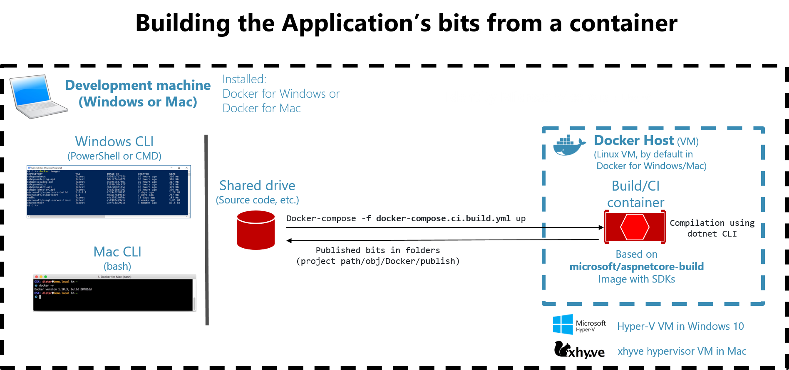

# Global prerequisite: Docker for Mac

Install [Docker for Mac](https://docs.docker.com/docker-for-mac/install/). The stable channel is fine.

## Configure Docker for Mac

### Docker for Mac (Linux VM) memory assigned
The SQL Server image for Docker requires more memory to run. You will need to update your Docker settings to allocate at least 4 GB of memory:


Depending on how many apps you are running in your Mac you might need to assign more memory to Docker in the Mac. Usually, 4GB should suffice, but we got feedback from devs who needed to assign up to 8GB of ram to Docker in the Mac.

### Folder shares in Docker for Mac
If your projects are placed within the /Users folder, you don't need to configure anything additional, as that is a pre-shared folder. However, if you place your projects under a different path, like /MyRootProjects, then you'd need to add that shared folder to Docker's configuration, here:


# Option A: Use Visual Studio for Mac
The quickest path to get eShopOnContainers running on your Mac is by using VS for Mac which will install most of the pre-requisites you need.

## Prerequisites

1. [Docker for Mac](https://docs.docker.com/docker-for-mac/install/). (You should already have this installed)
1. [Visual Studio for Mac](https://www.visualstudio.com/vs/visual-studio-mac/).

## Install Visual Studio for Mac

When installing [Docker for Mac](https://docs.docker.com/docker-for-mac/install/), you can select between multiple workloads or platforms.

Make sure you select the .NET Core platform:


Before completing the VS for Mac installation, it will demand you to install XCode, that is needed for multiple dependencies. 

If you install Android as a target platform, Java will also be installed as a dependency for building mobile apps for Android.

For running just the Docker containers and web apps, you'd just need the .NET Core platform.

But if you want to try the eShopOnContainers mobile app, that requires Xamarin and therefore, the iOS and Android platforms, too. Those mobile platforms are optional for this Wiki walkthrough, though. 

## Clone the eShopOnContainers repo

Open a bash shell and run the following command:

```
$ mkdir MyGitRepos
$ cd MyGitRepos
$ git clone https://github.com/dotnet-architecture/eShopOnContainers.git
$ cd eShopOnContainers
```

With that, you'll have the code at /Users/yourUser/MyGitRepos/eShopOnContainers folder.

## Open the 'eShopOnContainers-ServicesAndWebApps.sln' solution with VS for Mac

Run Visual Studio for Mac and open the solution `eShopOnContainers-ServicesAndWebApps.sln`.

If you just want to run the containers/microservices and web apps, do NOT open the other solutions, like `eShopOnContainers.sln` as those solutions will also open the Xamarin projects and that might slow you down when testing due to additional dependencies in VS.

After opening the `eShopOnContainers-ServicesAndWebApps.sln` solution for the first time, it is recommended to wait for a few minutes as VS will be restoring many NuGet packages and the solution won't be able to compile or run until it gets all the nuGet packages dependencies, in the first place (this time is only needed the first time you open the solution. Next times it is a lot faster).

This is VS for Mac with the `eShopOnContainers-ServicesAndWebApps.sln` solution. 


## Run eShopOnContainers from VS for Mac (F5 or Ctrl+F5)

Make sure that the by default start-up project is the Docker project named `docker-compose`.

Hit Ctrl+F5 or press the "play" button in VS for Mac.

IMPORTANT: The first time you run eShopOnContainers, it will take longer than the next time you launch it. Under the covers, Docker is pulling quite a few "heavy" images from Docker Hub (the public image registry), like the SQL Server image, Redis image, RabbitMQ image and the base ASP.NET Core images. That pull/download process will take a few minutes. Then, VS will launch the application custom containers plus the infrastructure containers (SQL, Redis, RabbitMQ and MongoDB), populate sample data in the databases and finally run the microservices and web apps on custom containers.

Note that you will see normal/controlled Http exceptions caused by our retries with exponential backoff, as the web apps have to wait until the microservices are ready for the first time which need first to run SQL sentences populating sample data, etc. 

Once the solution is up and running, you should be able to see it in the browser at:

http://localhost:5100


If you open a bash window, you can type `docker images` and see the pulled/downloaded images plus the custom images created by VS for Mac:


And by typing `docker ps` you can see the containers running in Docker. The infrastructure containers like SQL, Redis, RabbitMQ plus the custom containers running Web API microservices and the web apps.


*IMPORTANT:* In order to have the full app working, like being able to login with a user and add items to the basket and create orders, or being able to consume the services from a remote Xamarin or web SPA, you need to configure additional steps for the app, like the IP to be used by the Identity Service because it needs to be redirected, etc. - Check the additional configuration below.


# Option B: Use a CLI environment (dotnet CLI, Docker CLI with the bash shell) and VS Code as plain editor

## Prerequisites

1. [Docker for Mac](https://docs.docker.com/docker-for-mac/install/). You should already have this.
1. A Git client. The [git-scm site](https://git-scm.com/download/gui/mac) maintains a great list of clients.
1. [Node.js](http://nodejs.org). The stable channel is fine as well.
1. Bower ($ sudo npm install -g bower) needed by the MVC web app.
1. [.NET Core and SDK](http://dot.net). Install the SDK and runtime.


## B.1 - Building the application from a Docker Linux "build container"

This is the simples way to do it from the CLI, but until a [bug is solved in .NET CLI when running "dotnet publish" within a container](https://github.com/Microsoft/msbuild/issues/2153#issuecomment-305375162), please, follow the OPTION B.2 explained below (building .NET bits in the local Mac)

Open a bash shell and run the following four commands:

```
$ git clone https://github.com/dotnet-architecture/eShopOnContainers.git
$ cd eShopOnContainers
$ docker-compose -f docker-compose.ci.build.yml up
$ docker-compose up
```

The first two commands clone the git repository onto your machine, and changes the current directory to the root directory of the project.

The third command, `docker-compose -f docker-compose.ci.build.yml up` creates a Docker container based on an image used for Continuous Integration (CI) builds. That image has all the required SDKs and tools loaded on it. These include .NET Core, the .NET Core CLI and SDK, npm, and required npm packages. Once the container starts, it will mount your source directory as a shared drive, then build and publish all the projects that make up the eShopOnContainers application.

The final command `docker-compose up` pulls all the base Docker images needed, creates the images for each microservice, then launches each container that makes up the application.

## Running the application 

Once the containers have launched, open a browser and navigate to `http://localhost:5100` to visit the MVC application:

[[img/eShopOnContainersHomePage.png]]

You can also try the SPA style application by navigating to `http://localhost:5104`. Here are where all the 
services can be reached:

    - *MVC Application*: `http://localhost:5100`
    - *SPA Application*: `http://localhost:5105`
    - *Health Status*: `http://localhost:5107`
    - *Catalog Microservice API*: `http://localhost:5101`
    - *Ordering Microservice API*: `http://localhost:5102`
    - *Basket Microservice API*: `http://localhost:5103`
    - *Identity Microservice API*: `http://localhost:5105`
    - *Payment API*: `http://localhost:5108`
    - *Marketing API*: `http://localhost:5110`
    - *Locations API*: `http://localhost:5109`

To add items to the shopping cart or check out, you'll need to login to the site. 
The credentials for a demo user are:

- User: **demouser@microsoft.com**
- Password: **Pass@word1**

--------------------------------------------------------------------

## B.1.1 - Detailed procedure - Setting eShopOnContainers up using the Docker Linux build-container

The quick instructions above build all the projects that make up eShopOnContainers in a Docker Linux 
"build-container". That's the preferred way to build the application. It's easier to make sure all the
prerequisites are installed, every developer uses the same version of all the tools, and
you have a consistent experience from any build.

This section (B.1.1) is just a further explanation of that method.

### The Docker Linux build container 

As mentioned, the recommended approach is to build the .NET bits and Docker images by using an special build
container from the CLI or your CI/CD pipeline. What you run and test locally is built using the
same process as your CI/CD pipleine. The verions of all tools are the same, the same version of
all SDKs are used, and so on. This ensures consistency across all builds.



The build container to use is based on the `image: microsoft/aspnetcore-build` ASP.NET Core
build image which includes the .NET SDK, NPM and many other Web and ASP.NET dependencies
(Gulp, Bower, NPM, etc.) to build your services and web apps.

Contrast the four commands you ran above, along with the minimal prerequisites, with the
list of prerequisites and tools needed to build locally on your machine.


## B.2 - Building the application binaries on the local Mac (local .NET Core in Mac)

You can build the application using your local Mac machine.  You'll need the following
prerequisites installed, in addition to those listed above for building using the CI container.

    - *[.NET Core and SDK](http://dot.net)*
    - *[Node and NPM](http://nodejs.org)* - Just needed in order to install NPM.
    - *Bower* ($ sudo npm install -g bower) needed by the MVC web app.

### Install .NET Core 2.0 or later

Install [.NET Core 2.0 SDK or later, for Mac](https://www.microsoft.com/net/core#macos) as shown in the image:


### Install Node (needed so it installs NPM)

In order to be able to build the JavaScript dependencies from command line by using NPM you need to install npm globally.

NPM is bundled with NODE.JS. Installing NPM and NODE is pretty straightforward by using the installer package available at https://nodejs.org/en/

Install [NodeJS 6.11.5 LTS or latest Long Term Service version](https://nodejs.org/en/)

You can see the installed NPM version with the command npm -v, as shown below.


### Install Bower globally

In bash, run the following command:

 ```bash
 $ sudo npm install -g bower
 ```
As shown in the following screenshot:


### Build the eShopOnContainers .NET binaries with 'dotnet publish'
 
You could generate the binaries manually, with 'dotnet publish', but for your convenience, we've included a bash script that runs all the 'dotnet publish' commands on your local Mac and generates the bits in the right folders expected by Docker and Visual Studio, if you use VS with the same solution, eventually. 

 Using the bash windows, navigate to your eShopOnContainers directory, and cd into the *cli-mac* directory. Then, run the build script:

 ```bash
 $ ./build-bits.sh
 ```

 This script runs a dotnet restore, build, and publish for each project using the `dotnet` CLI tool.
 In addition, it runs the client build commands using *npm* to build the SPA application
 assets. Finally, it will remove old docker containers and images.

After you've finished the build, you can create the Docker images defined at the docker-compose.yml file by using `docker-compose build`:

```bash
$ docker-compose build
```

To run the containers, you use `docker-compose up` again:

```bash
$ docker-compose up
```
You could also go ahead and directly run `docker-compose up` and it will first build the Docker images like when you run `docker-compose build`, though.

The first time you run `docker-compose up`, it will pull the necessary docker images from Docker hub. That will take some time. Once the base Docker images have been pulled, the application will start and you can test it out using the browser and the addresses shown [above](#running-the-application).

For testing the MVC web app, run `http://localhost:5100` in any browser, so you'll see it like the following:


# Configuring the app for Authentication and access from remote client apps

## Setting up the docker-compose file environment variables and settings

The Mac has a changing IP address (or none if you have no network access). From 17.06 onwards our recommendation is to connect to the special Mac-only DNS name docker.for.mac.localhost which will resolve to the internal IP address used by the host.

Therefore, the following change must be done in docker-compose.override.yml.
In the WebMVC service section, replace the IdentityUrl environment variable with:

 ```bash
    IdentityUrl=http://docker.for.mac.localhost:5105
 ```
The WebMVC service definition should finally be configured as shown bellow:

 ```bash
    webmvc:
    environment:
      - ASPNETCORE_ENVIRONMENT=Development
      - ASPNETCORE_URLS=http://0.0.0.0:80
      - CatalogUrl=http://catalog.api
      - OrderingUrl=http://ordering.api
      - BasketUrl=http://basket.api
      - IdentityUrl=http://docker.for.mac.localhost:5105
      - MarketingUrl=http://marketing.api  #Local:  Use 10.0.75.1 in a "Docker for Windows" environment, if using "localhost" from browser. 
                                                 #Remote: Use ${ESHOP_EXTERNAL_DNS_NAME_OR_IP} if using external IP or DNS name from browser. 
      - UseCustomizationData=True
    ports:
      - "5100:80"
 ```


## Sending feedback and pull requests

We'd appreciate to your feedback, improvements and ideas.
You can create new issues at the issues section, do pull requests and/or send emails to eshop_feedback@service.microsoft.com 

## Questions
[QUESTION] Answer +1 if the solution is working for you on the Mac:
https://github.com/dotnet/eShopOnContainers/issues/107 