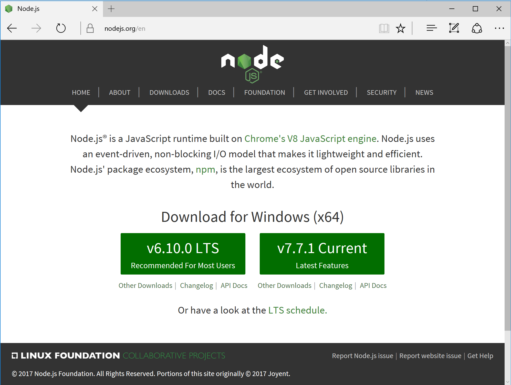
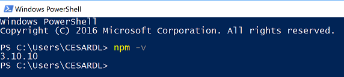
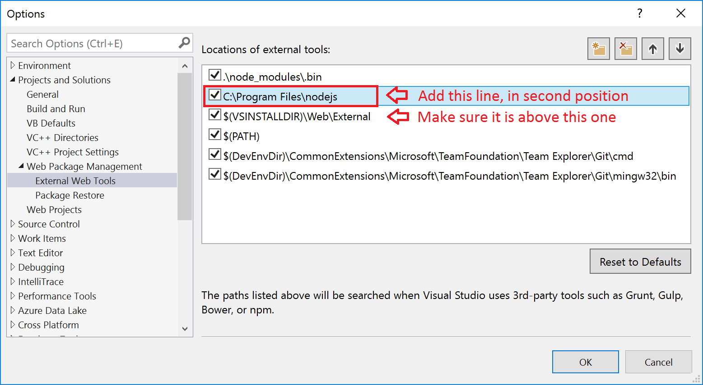
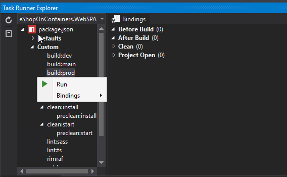

The Web SPA application needs a few additional steps to make it work due to its JavaScript frameworks dependencies and JS code to be built before generating the Docker Images.

## Requirements and set up

### Install NPM
In order to be able to build the JavaScript dependencies from command line by using npm you need to install npm globally.

NPM is bundled with NODE.JS. Installing NPM and NODE is pretty straightforward by using the installer package available at https://nodejs.org/en/

You can install the version "Recommended For Most Users" of Node which at the moment of this writing was v6.10.0 LTS.
You can see the installed NPM version with the command <b>npm -v</b>, as shown below.

### Set NPM path into Visual Studio
This step is only required if you are also using the full Visual Studio 2017.
NPM (just installed by you) will be usually installed under this path:
<b>C:\Program Files\nodejs</b>.
You need to update that path in Visual Studio under the "External Web Tools" location paths, as shown below:

If you don't do this step you might have issues because of using different versions from VS versus the command line accessing the same JavaScript code from both environments.
See:
http://www.hanselman.com/blog/VisualStudio2015FixingDependenciesNpmNotInstalledFromFseventsWithNodeOnWindows.aspx

### Build the SPA app with NPM
Now, you need to build the SPA app (TypeScript and Angular 4 based client app) with NPM.
* Open a command-prompt window and move to the root of the SPA application (src\Web\WebSPA\eShopOnContainers.WebSPA)
* Run the command <b>npm install</b> as shown below:

---------------

**IMPORTANT NOTE/UPDATE:** Seems like in some NPM environments running just "npm install" does not work properly. If you have a similar issue than [this issue](https://github.com/dotnet-architecture/eShopOnContainers/issues/253): try running **"npm install enhanced-resolve@3.3.0"** instead "npm install". (Please, provide your experience at that mentioned issue)

---------------

* Then, run the command <b>npm run build:prod</b> as shown below:

* If you get an error like <b>"Node Sass could not find a binding for your current environment: Windows 64-bit with Node.js 6.x"</b>, then run the command <b>npm rebuild node-sass</b> as in the following screenshot:

    

    Then, run again the <b>npm run build:prod</b> command that should finish with no errors.

    

#### (Optional) Run NPM tasks from within Visual Studio 2017

As the chosen workload method when developing a client frontend app (JS frameworks, etc.), the developer has to be able to trigger the npm tasks when he wants. 
Of course, he can always open a command propmt and run npm from the CLI as you just did in the steps above (which is most front-end devs do, in fact). 
However, you can also run npm tasks inside Visual Studio if you install the following VS extension: https://marketplace.visualstudio.com/items?itemName=MadsKristensen.NPMTaskRunner

This extension adds to the "Task Runner Explorer" the capabailities to run npm tasks (since, out of the box, only gulp/grunt tasks are supported by VS2017). After this extension is installed you can run npm tasks from inside VS2017 and also set build bindings if you wanted.

This extension honors the VS External Web Tools configuration, and allows you to use bindings, so if you want to run npm tasks automatically on every VS build, you could do so. This is not set as default in the eShopOnContainers provided code as it would slow down each VS build with the npm build tasks.

### Build the Docker images and Deploy the containers
At this point, if you were originally following the eShopOnContainer setup for any environment and came to this page just to setup the SPA app, now go back to your original setup instructions page. Other than that, you can in any case choose between any of the following options to build and deploy the Docker containers:

1. **VS 2017 based:** Build and deploy in a single step from Visual Studio 2017 as explained in this page: https://github.com/dotnet/eShopOnContainers/wiki/02.-Setting-eShopOnContainer-solution-up-in-a-Visual-Studio-2017-environment

2. **CLI on Windows:** Build the .NET bits with the build-container based on dontnet CLI and Docker CLI, as explained in this page: https://github.com/dotnet/eShopOnContainers/wiki/03.-Setting-the-eShopOnContainers-solution-up-in-a-Windows-CLI-environment-(dotnet-CLI,-Docker-CLI-and-VS-Code)

3. **CLI on Mac:** Build the .NET bits with the build-container based on dontnet CLI and Docker CLI, as explained in this page: https://github.com/dotnet/eShopOnContainers/wiki/04.-Setting-eShopOnContainer-solution-up-in-a-Mac,-VS-Code-and-CLI-environment--(dotnet-CLI,-Docker-CLI-and-VS-Code)

## Troubleshooting the SPA app when building from the CLI

The Docker image build could do npm install if needed, but this installs npm linux packages, not the windows ones. As the docker container used for build has a volume mapping with the source code, that means that the "node_modules" of the SPA web application ends having npm linux modules. In fact, windows & linux modules are the same (they’re node modules, so are in js) but windows modules have an additional .cmd file in the node_modules\.bin folder. This file is needed for all CLI-invokable modules (like webpack or rimraf). As linux modules do no have it, **if you build once with the docker image, and later do you want to build using the windows CLI you will get errors due to not having these files. Solution here is delete the "node_modules" folder and do an npm install (from Windows)**. 

How to avoid having this issue?: doing an "npm install"  from Windows BEFORE running the docker CI build, as documented here: https://github.com/dotnet/eShopOnContainers/wiki/03.-Setting-the-eShopOnContainers-solution-up-in-a-Windows-CLI-environment-(dotnet-CLI,-Docker-CLI-and-VS-Code)

Everytime you change from Linux based build (Docker) to a Windows based build (CLI) you’ll need to do “npm rebuild node-sass”. Our Docker compose ci.build file does it for you, but if you switch to windows, you’ll need to do it manually.

## Sending feedback and pull requests
We'd appreciate to your feedback, improvements and ideas.
You can create new issues at the issues section, do pull requests and/or send emails to eshop_feedback@service.microsoft.com 
