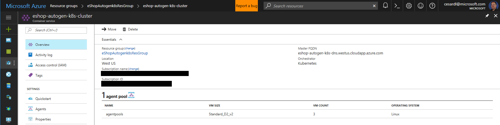
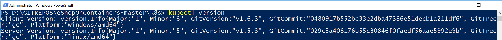
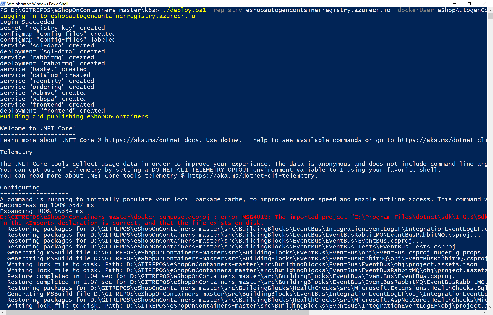

# Introduction to Kubernetes and ACS (Azure Container Service)

## Azure Container Service (ACS)
Azure Container Service makes it simpler for you to create, configure, and manage a cluster of virtual machines that are preconfigured to run containerized applications (based on Docker container format), in Azure. 
ACS uses an optimized configuration of popular open-source scheduling and orchestration tools such as KUBERNETES, DOCKER SWARM and Mesosphere DC/OS, so you can you can scale these applications to thousands of containers.
In this case, targeting Kubernetes, ACS is basically the infrastructure in Azure where you create your Kubernetes cluster.

## Docker and Kubernetes
Docker helps you package applications into images, and execute them in containers. Kubernetes is a robust orchestrator platform for containerized applications. It abstracts away the underlying network infrastructure and hardware required to run them, simplifying their deployment, scaling, and management.

## Kubernetes from the container up
### Pods
The basic unit of a Kubernetes deployment is the **Pod**. A Pod encapsulates one or more containers. For example, the `basket` Pod specifies two containers:
>`deployments.yaml`
>
>The first container runs the `eshop/basket.api` image:
>```yaml
>spec:
>  containers:
>  - name: basket
>    image: eshop/basket.api
>    env:
>    - name: ConnectionString
>      value: 127.0.0.1
>```
>Note the `ConnectionString` environment variable: containers within a Pod are networked via `localhost`. The second container runs the `redis` image:
>```yaml
>- name: basket-data
>  image: redis:3.2-alpine
>  ports:
>  - containerPort: 6379
>```
Placing `basket` and `basket-data` in the same Pod is reasonable here because the former requires the latter, and owns all its data. If we wanted to scale the service, however, it would be better to place the containers in separate Pods because the basket API and redis scale at different rates.

If the containers were in separate Pods, they would no longer be able to communicate via `localhost`; a **Service** would be required.

### Services
Services expose Pods to external networks. For example, the `basket` Service exposes Pods with labels `app=eshop` and `component=basket` to the cluster at large:
>`services.yaml`
>```yaml
>kind: Service
>metadata:
>  ...
>  name: basket
>spec:
>  ports:
>  - port: 80
>  selector:
>    app: eshop
>    component: basket
>```
Kubernetes's built-in DNS service resolves Service names to cluster-internal IP addresses. This allows the nginx frontend to proxy connections to the app's microservices by name:
>`nginx.conf`
>```
>location /basket-api {
>    proxy_pass http://basket;
>```
The frontend Pod is different in that it needs to be exposed outside the cluster. This is accomplished with another Service:
>`frontend.yaml`
>```yaml
>spec:
>  ports:
>  - port: 80
>    targetPort: 8080
>  selector:
>    app: eshop
>    component: frontend
>  type: LoadBalancer
>```
`type: LoadBalancer` tells Kubernetes to expose the Service behind a load balancer appropriate for the cluster's platform. For Azure Container Service, this creates an Azure load balancer rule with a public IP.

### Deployments
Kubernetes uses Pods to organize containers, and Services to network them. It uses **Deployments** to organize creating, and modifying, Pods. A Deployment describes a state of one or more Pods. When a Deployment is created or modified, Kubernetes attempts to realize that state.

The Deployments in this project are basic. Still, `deploy.ps1` shows some more advanced Deployment capabilities. For example, Deployments can be paused. Each Deployment of this app is paused at creation:
>`deployments.yaml`
>```yaml
>kind: Deployment
>spec:
>  paused: true
>```
This allows the deployment script to change images before Kubernetes creates the Pods:
>`deploy.ps1`
>```powershell
>kubectl set image -f deployments.yaml basket=$registry/basket.api ...
>kubectl rollout resume -f deployments.yaml
>```

### ConfigMaps
A **ConfigMap** is a collection of key/value pairs commonly used to provide configuration information to Pods. The deployment script uses one to store the frontend's configuration:
>`deploy.ps1`
>```
>kubectl create configmap config-files from-file=nginx-conf=nginx.conf
>```
This creates a ConfigMap named `config-files` with key `nginx-conf` whose value is the content of nginx.conf. The frontend Pod mounts that value as `/etc/nginx/nginx.conf`:
>`frontend.yaml`
>```yaml
>spec:
>  containers:
>  - name: nginx
>  ...
>  volumeMounts:
>  - name: config
>    mountPath: /etc/nginx
>  volumes:
>  - name: config
>    configMap:
>      name: config-files
>      items:
>      - key: nginx-conf
>        path: nginx.conf
>```
This facilitates rapid iteration better than other techniques, e.g. building an image to bake in configuration.

The script also stores public URLs for the app's components in a ConfigMap:
>`deploy.ps1`
>```powershell
>kubectl create configmap urls --from-literal=BasketUrl=http://$($frontendUrl)/basket-api ...
>```
>Here's how the `webspa` Deployment uses it:
>
>`deployments.yaml`
>```yaml
>spec:
>  containers:
>  - name: webspa
>    ...
>    env:
>      ...
>      - name: BasketUrl
>        valueFrom:
>          configMapKeyRef:
>            name: urls
>            key: BasketUrl
>```

### Further reading
* [Kubernetes Concepts](https://kubernetes.io/docs/concepts/)
* [kubectl for Docker Users](https://kubernetes.io/docs/user-guide/docker-cli-to-kubectl/)
* [Kubernetes API reference](https://kubernetes.io/docs/api-reference/v1.5/)


# Setting eShopOnContainers up on Kubernetes (in Azure Container Service)

## Prerequisites
To create an Azure Container Service cluster using the Azure CLI 2.0, you must:
* Have an Azure account (get a free trial)
* A Docker development environment with `docker` and `docker-compose`. You should already have this environment if you were already testing eShopOnContainers on Docker. Other than that:
    * Visit [docker.com](https://docker.com) to download the tools and set up the environment. Docker's [installation guide](https://docs.docker.com/engine/getstarted/step_one/#step-3-verify-your-installation) covers verifying your Docker installation.
* Have installed and set up the Azure CLI 2.0 (Explained in the next step)

** Installing Azure CLI 2.0
If you don't have Azure CLI installed, install it following these steps: 
https://docs.microsoft.com/en-us/cli/azure/install-azure-cli
Once Azure CLI is installed, test it by simply writing "az" and hitting enter on your PowerShell:


Next, to verify the installation was successful, run `az --version` from your command line.
You should see the version number of Azure CLI and other dependent libraries installed on your computer.

## Creating a Kubernetes cluster in ACS (Azure Container Service) and Azure environment
TBD

## Creating the Azure environment automatically with a PowerShell script provided by eShopOnContainers
You can run the gen-k8s-env.ps1 PowerShell script (from eShopOnContainers) to automatically create the Azure environment needed for a Kubernetes deployment. 
Steps to follow:

1. Make sure you have **Azure CLI 2.0** or later version installed on your dev machine. If you don't have it installed, follow the previous section that explained it.

2. **Run the gen-k8s-env.ps1 script**. Make sure that you are positioned in the folder at the PowerShell prompt (like [eShopOnContainers folder]\k8s), the run the following command but with your own names and IDs.

    >```
    >./gen-k8s-env -resourceGroupName eShopAutogenk8sResGroup -location westus -registryName eShopAutogenContainerRegistry -orchestratorName eshop-autogen-k8s-cluster -dnsName eshop-autogen-k8s-dns
    >```

    The execution should be similar to the following screenshot. It will take a few minutes to complete:
    

    At the end of that execution you will see the passwords generated for your Azure Container Registry. Copy those passwords so you can use it later (and change it later, if you wish).

    You can see in Azure's portal how the ACS-Kubernetes cluster was created with its basic information, such as the Master FQDN: 
eshop-autogen-k8s-dns.westus.cloudapp.azure.com 
    
    
    <p>
    <p>
4. **Install the Kubernetes command line client**, `kubectl`.
    * You can install `kubectl` with `az acs kubernetes install-cli` as in the following screenshot (use 'sudo' if in a Mac or Linux). (You can also download it from the [Kubernetes site](https://kubernetes.io/docs/tasks/tools/install-kubectl/))
    
    By default, this command installs the `kubectl` binary to `C:\Program Files (x86)\kubectl.exe` on Windows or to `/usr/local/bin/kubectl` on a Linux or macOS system. To specify a different installation path, use the `--install-location` parameter.
    After `kubectl` is installed, add its directory in your system path. MAke sure you access to its path by typing `kubectl version` as in the following screenshot:
    
    
    * For further info about `az` tool and Kubernetes see the Azure Container Service [walkthrough](https://docs.microsoft.com/en-us/azure/container-service/container-service-kubernetes-walkthrough). 
    * `az` is also helpful for getting the credentials `kubectl` needs to access your cluster. For other installation options, and information about configuring `kubectl` yourself, see the [Kubernetes documentation](https://kubernetes.io/docs/tasks/kubectl/install/).


## Deploying eShopOnContainers to Kubernetes in ACS (Azure Container Service) with the deployment script
We have simplified the deployment so you can do it just by executing a script by following the following few steps:

1. Open a PowerShell command line at the `k8s` directory of your local eShopOnContainers repository.
2. Ensure `docker`, `docker-compose`, and `kubectl` are on the path, and configured for your Docker machine and Kubernetes cluster.
3. Run `deploy.ps1` with your registry information. The Docker username and password are provided by Azure Container Registry, and can be retrieved from the Azure portal. Optionally, ACR credentials can be obtained by running the following command:

>```
>az acr credential show -n eShopAutogenContainerRegistry
>```


Once the user and password are retrieved, run the following script for deployment, including your values and password. For example:
>```
>./deploy.ps1 -registry eshopautogencontainerregistry.azurecr.io -dockerUser eShopAutogenContainerRegistry -dockerPassword SecretPassword
>```


The script will build the .NET Core code, SPA TypeScript code and corresponding Docker images, push the latter to your registry at Azure Container Registry, and deploy the application to your cluster. 

You can watch the deployment unfold from the Kubernetes web interface: run `kubectl proxy` and open a browser to [http://localhost:8001/ui](http://localhost:8001/ui) as in the following screenshot:


Finally you can test the web applications at:
>```
>WebSPA is exposed at http://your_kubernetes_cluster_ip
>```

>```
>WebMVC at http://your_kubernetes_cluster_ip/webmvc
>```

## Scaling out eShopOnContainers in Kubernetes
TBD


## Sending feedback and pull requests
We'd appreciate to your feedback, improvements and ideas.
You can create new issues at the issues section, do pull requests and/or send emails to  
[eshop_feedback@service.microsoft.com](eshop_feedback@service.microsoft.com)

## Questions
[QUESTION] Answer +1 if the solution is working for you (Through VS2017 or CLI environment):
https://github.com/dotnet/eShopOnContainers/issues/107 


