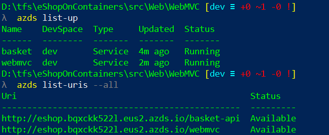

# Azure Devspaces Support

Please [go to official devspaces doc](https://docs.microsoft.com/en-us/azure/dev-spaces/). You should be familiar with:

* Enabling devspaces to a cluster
* Creating a devspace
* Creating a child devspace
* Deploy to a devspace

## Enabling devspaces

You need an AKS created in a admitted Devspaces region. Then just type:

```
az aks use-dev-spaces -g your-aks-devspaces-resgrp -n YourAksDevSpacesCluster
```

Note: This command will install the _Azure Devspaces CLI_ if not installed in your computer. 

The tool will ask us to create a dev space. Enter the name of the devspace (i. e. `dev`) and make it a root devspace by selecting _none_ when prompted for their parent dev space:


Once devspaces tooling is added, type `azds --version` to get the version of DevSpaces tooling.
Tested DevSpaces tooling version was:

``` 
Azure Dev Spaces CLI (Preview)
0.1.20190320.5
API v2.17
```

Future versions should work, unless they introduce _breaking changes_.

## Prepare environment for DevSpaces

From a Powershell console, go to `/src` folder and run `prepare-devspaces.ps1` (no parameters needed). This script will copy the `inf.yaml` and `app.yaml` files from `/k8s/helm` to all project folders. This is needed due to a limitation of devspaces tooling used. Note that the files copied are added in `.gitignore`.

Remember that the `inf.yaml` and `app.yaml` contains the parameters needed for the helm charts to run.


## Deploy to a devspace

Devspaces deployment is done using the **same helm charts used to deploy on a "production" cluster**.

If you want to deploy a project to a specific devspace, just go to its source folder (where the `.csproj` is) and type `azds up`. This will deploy the project to the current devspace. You can use the `-v` modifier to have more verbosity and the `-d` modifier to dettach the terminal from the application. If `-d` is not used, the `azds up` command is attached to the service running and you are able to see its logs.

The command `azds up` will:

1. Sync files with the devspace builder container
2. Deploy the helm chart 
3. Build the service container
4. Attach current console to the container output (if not `-d` is passed)

**Note** You should deploy **all** enabled devspaces projects (one by one) in the parent devspace

The command `azds list-up` will show which APIs are deployed in the devspace. The command `azds list-uris` will show the ingress URLs:



## Deploy to a child devspace

Once everything is deployed to the root devspace, use `azds space select` to create a child devspace.


 Then deploy the desired service to this child devspace (using `azds up` again). Use `azds list-up` to verify that the service is deployed in the child devspace. The image shows the _WebMVC_ deployed in the child devspace _alice_:

 

 The `azds list-uris` will show you the new ingress URL for the child devspace:
 
  

  If you use the child URL (starting with `alice.s.`), the Web MVC that will run will be the one that is deployed in the child devspace. This web will use all services deployed in the child devspaces and if not found, will use the ones deployed in the parent devspace.

  If using the parent devspace URL, Web MVC that will run will be the one deployed in parent devspace, using only the services deployed in parent devspace.

Usually you deploy everything in the parent devspace, and then create one child devspace per developer. The developer deploys only the service he is updating in his/her namespace. 

Please refer to [Devspaces documentation](https://docs.microsoft.com/en-us/azure/dev-spaces/) for more info.

**Note**: _Web SPA_ is not enabled to use Dev Spaces (so, you can't deploy the SPA in devspace). Use the Web MVC for testing.

