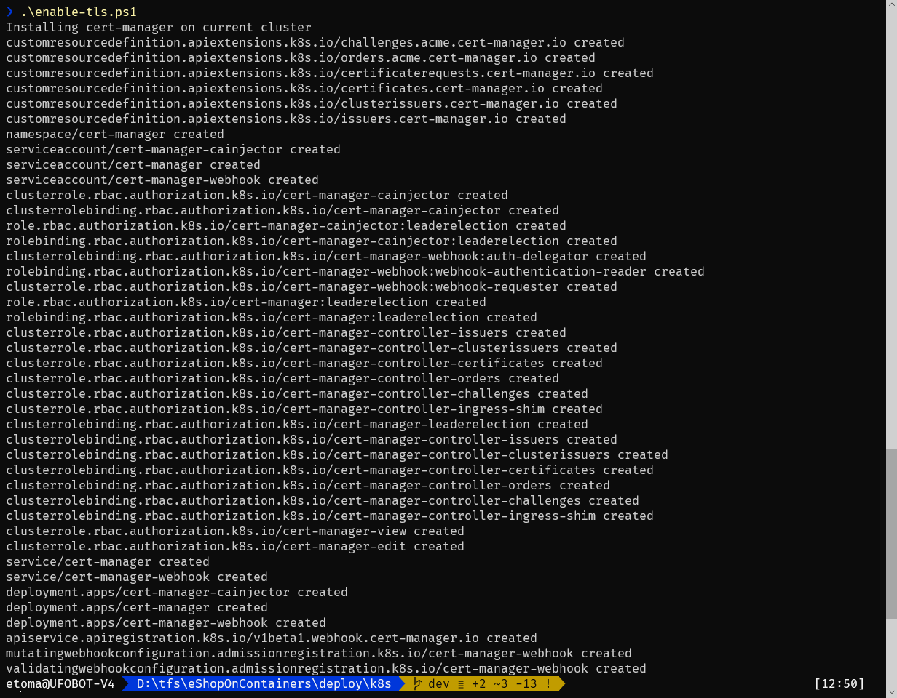

# Enabling TLS on AKS

eShopOnContainers supports the use of TLS for enabling `https` on ingress endpoints. You can provide your own TLS certificate or let the system auto-generate one certificate using [Let's encrypt](https://letsencrypt.org/).

## Auto Generating certificates using Let's Encrypt

Using [cert-manager](https://cert-manager.io/docs/) is possible to auto retrieve a TLS certificate generate by Let's Encrypt.

### Installing cert-manager on the cluster

You must install cert-manager in the cluster. This is an administrative action, needed to be performed only once.

The script `/deploy/k8s/enable-tls.ps1` installs cert-manager on the current cluster. The script uses `kubectl` to install the cert-manager version `0.11.0` (the minimum required by eShopOnContainers) in the cluster. By default cert-manager is installed on the current kubectl context, but you can use the parameters `aksRg` and `aksName` to set a specific AKS to use.

```
.\enable-tls.ps1 -aksName eshopmesh -aksRg eshop-mesh
```



### Deploying the cert-manager issuer

Once cert-manager is installed on the cluster you have to install the issuer that will be used to generate the certificates. There are two issuers provided:

* Let's Encrypt staging server
* Let's Encrypt production server

Staging server do not generate valid TLS certificates, but allows you to test the whole process is valid. Let's Encrypt has severe ratio calls on its production server to avoid abuses. [Let's Encrypt staging](https://letsencrypt.org/docs/staging-environment/) server uses the "Fake LE Intermediate X1" CA to sign the certificates.

To deploy the selected issuer (you can deploy both) use helm to install the chart `tls-support` and pass the file `values-staging.yaml` or `values-prod.yaml`. For example, following command (run from `/deploy/k8s/helm` folder) will install the Let's Encrypt staging issuer:

```
helm install .\tls-support -f .\tls-support\values-staging.yaml -n tls-staging
```

**Note**: You can retrieve the installed issuers using `kubectl get issuers` command.

#### Using an ingress controller other than Http Application Routing

If you are using other ingress controller rather than Http Application Routing, you must edit the issuer values file (`values-staging.yaml` or `values-prod.yaml`) and set the value of `ingressClass` accordingly before installing the issuer.

### Deploying using deploy-all.ps1

To deploy eShopOnContainers to use Let's Encrypt, just add following parameter to `deploy-all.ps1` script:

* `sslSupport`: Set to `prod` or `staging` depending the issuer you want to use.

You **must** set a DNS when using TLS (set `exteralDns` to `aks` to infer the Http Application Routing DNS).

## Deploy with a custom certificate

If deploying with a custom certificate, you don't need to install cert-manager nor any issuer. You must:

* [Install the TLS certificate as a Kubernetes secret](https://docs.microsoft.com/es-es/azure/aks/ingress-own-tls#create-kubernetes-secret-for-the-tls-certificate) using `kubectl create secret tls`. 

Once the secret is installed you can install eShopOnContainers adding following parameters to `deploy-all.ps1`:

* `sslSupport` set to `custom`
* `tlsSecretName` with the name of the Kubernetes secret that contains the TLS certificate (defaults to `eshop-tls-custom`).

## Notes on TLS support

TLS support can't be enabled on the local Kubernetes provided by Docker Desktop.
