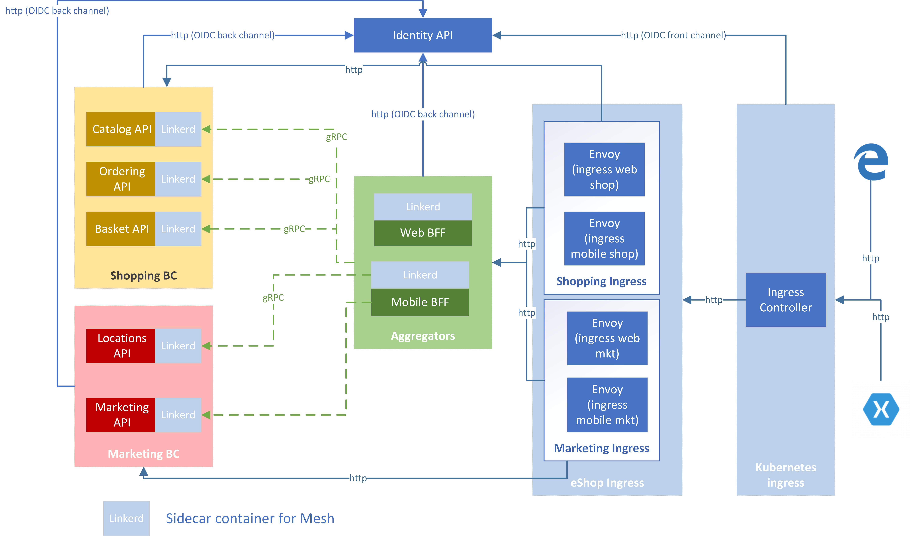

eShopOnContainer uses four API Gateways that implement the [Backend for Frontends (BFF) pattern](https://samnewman.io/patterns/architectural/bff/).

Overall architecture is shown in the next diagram:

The image above is the architecture when running eShopOnContainers on Kubernetes with Service Mesh enabled. If Service Mesh is disabled all of the "Linkerd" containers don't exist and if running outside Kubernetes the "Ingress controller" doesn't exists and you access directly the API Gateways.

In this architecture the four blue boxes in the column labelled as "eShop Ingress" are the four BFFs.

Currently they are implemented using [Envoy](https://www.envoyproxy.io/). Each BFF provides a unique endpoint for its clients and then forwards the call to the specific microservice or the custom aggregator.

It's important to highlight that:

- The communication between BFF and the microservices plus aggregator is HTTP/REST.
- The communication between the aggregators and the microservices is gRPC.

This could change in the future by using gRPC from the BFF to the microservices plus aggregators, while maintaining an HTTP/REST façade from the BFFs to the clients.
