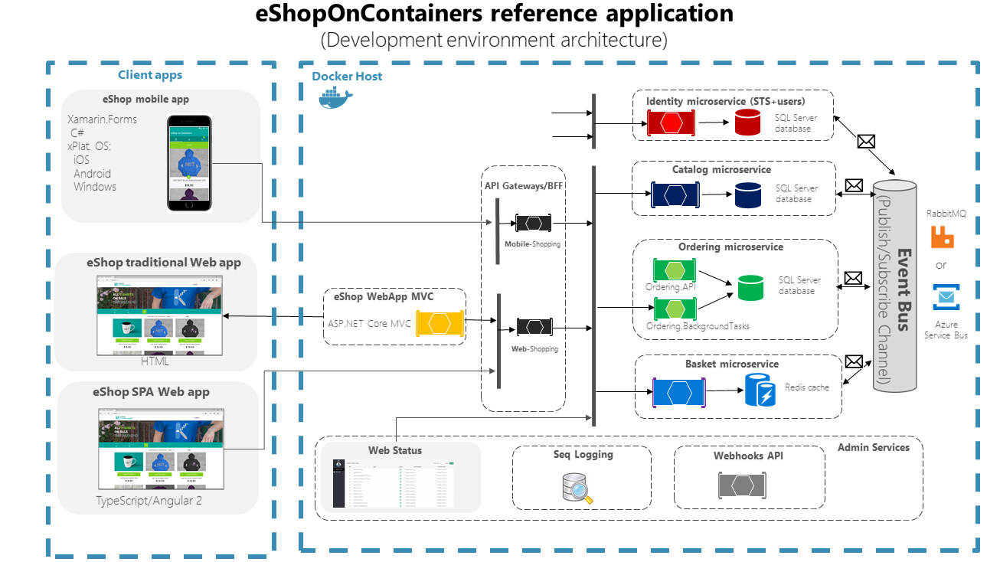

## Overview

This reference application is cross-platform for both the server and client side, thanks to .NET Core services, it's capable of running on Linux or Windows containers depending on your Docker host. It also has a Xamarin mobile app that supports Android, iOS and Windows/UWP, as well as an ASP.NET Core Web MVC and an SPA apps.

The architecture proposes a microservice oriented architecture implementation with multiple autonomous microservices (each one owning its own data/db). The microservices also showcase different approaches from simple CRUD to more elaborate DDD/CQRS patterns. HTTP is the communication protocol between client apps and microservices, and asynchronous message based communication between microservices.  Message queues can be handled either with RabbitMQ or Azure Service Bus, to convey integration events.

Domain events are handled in the ordering microservice, by using [MediatR](https://github.com/jbogard/MediatR), a simple in-process implementation the Mediator pattern.

## EventBus

eShopOnContainers includes a simplified EventBus abstraction to handle integration events, as well as two implementations, one based on [RabbitMQ](https://www.rabbitmq.com/) and another based on [Azure Service Bus](https://docs.microsoft.com/en-us/azure/service-bus/).

For a production-grade solutions you should use a more robust implementation based on a robust product such as [NServiceBus](https://github.com/Particular/NServiceBus). You can even see a (somewhat outdated) implementation of eShopOnContainers with NServiceBus here: https://github.com/Particular/eShopOnContainers.

## API Gateways

The architecture also includes an implementation of the API Gateway pattern and Backend-For-Front-End (BFF), to publish simplified APIs and include additional security measures for hiding/securing the internal microservices from the client apps or outside consumers. 

These sample API Gateways are based on [Ocelot](https://github.com/ThreeMammals/Ocelot), an OSS lightweight API Gateway solution. The API Gateways are deployed as autonomous microservices/containers, so you can test them in a simple development environment by just using Docker Desktop or even with orchestrators like Kubernetes in AKS or Service Fabric.

For a production-ready architecture you can either keep using Ocelot, which is simple and easy to use, and it's currently used in production by large companies. If you need additional functionality and a much richer set of features suitable for commercial APIs, you can also substitute those API Gateways and use Azure API Management or any other commercial API Gateway, as shown in the following diagram.

## Internal architectural patterns

There are different types of microservices according to their internal architectural pattern and approaches depending on their purposes, as shown in the image below.

## Database servers

There are four SQL Server databases, but they are all deployed to a single container, to keep memory requirements as low as possible. This is not a recommended approach for production deployment, where you should use high availability solutions.

There are also one Redis and one MongoDb instances, in separate containers, as a sample of two widely used NO-SQL databases.

## More on-line details and guidance

You can get more details on the related technologies and components in these selected articles from the [.NET Microservices architecture guide](https://docs.microsoft.com/dotnet/standard/microservices-architecture/):

- [Introduction to containers and Docker](https://docs.microsoft.com/dotnet/standard/microservices-architecture/container-docker-introduction/)

- [Key concepts of microservices container based applications](https://docs.microsoft.com/dotnet/standard/microservices-architecture/architect-microservice-container-applications/)
  - [Data sovereignty and eventual consistency](https://docs.microsoft.com/dotnet/standard/microservices-architecture/architect-microservice-container-applications/data-sovereignty-per-microservice)
  - [API gateways](https://docs.microsoft.com/dotnet/standard/microservices-architecture/architect-microservice-container-applications/direct-client-to-microservice-communication-versus-the-api-gateway-pattern)
  - [Communication in a microservices architecture](https://docs.microsoft.com/dotnet/standard/microservices-architecture/architect-microservice-container-applications/communication-in-microservice-architecture)
  - [Asynchronous message-based communications](https://docs.microsoft.com/dotnet/standard/microservices-architecture/architect-microservice-container-applications/asynchronous-message-based-communication)
  - [Resiliency](https://docs.microsoft.com/dotnet/standard/microservices-architecture/architect-microservice-container-applications/resilient-high-availability-microservices)
  - [Clusters and orchestrators](https://docs.microsoft.com/dotnet/standard/microservices-architecture/architect-microservice-container-applications/scalable-available-multi-container-microservice-applications)

- [Details on the eShopOnContainers sample application](https://docs.microsoft.com/dotnet/standard/microservices-architecture/multi-container-microservice-net-applications/)

- [Key concepts of Domain Driven Design (DDD) and Command and Query Responsibility Segregation (CQRS)](https://docs.microsoft.com/dotnet/standard/microservices-architecture/microservice-ddd-cqrs-patterns/)

- [Implementing resilient applications](https://docs.microsoft.com/dotnet/standard/microservices-architecture/implement-resilient-applications/)

- [Authentication and authorization](https://docs.microsoft.com/dotnet/standard/microservices-architecture/secure-net-microservices-web-applications/)

- [The development process for Docker-based applications](https://docs.microsoft.com/dotnet/standard/microservices-architecture/docker-application-development-process/)

