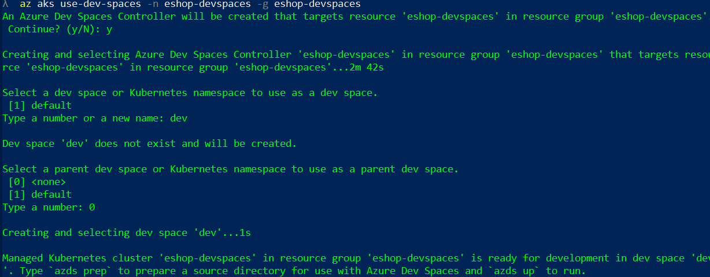
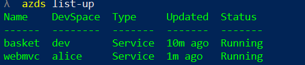

Please [go to the official Dev Spaces documentation](https://docs.microsoft.com/azure/dev-spaces/) for details.

You should be familiar with the topics that follow.

> **CONTENT**

- [Enabling Dev Spaces](#enabling-dev-spaces)
- [Prepare environment for Dev Spaces](#prepare-environment-for-dev-spaces)
- [Deploy to a dev space](#deploy-to-a-dev-space)
- [Deploy to a child dev space](#deploy-to-a-child-dev-space)

## Enabling Dev Spaces

You need an AKS created in an admitted Dev Spaces region. Then just type:

```console
az aks use-dev-spaces -g your-aks-devspaces-resgrp -n YourAksDevSpacesCluster
```

Note: This command will install the _Azure Dev Spaces CLI_ if not installed in your computer. 

The tool will ask us to create a dev space. Enter the name of the dev space (i. e. `dev`) and make it a root dev space by selecting _none_ when prompted for their parent dev space:



Once Dev Spaces tooling is added, type `azds --version` to get the version of Dev Spaces tooling.
Tested DevSpaces tooling version was:

```console
Azure Dev Spaces CLI (Preview)
0.1.20190320.5
API v2.17
```

Future versions should work, unless they introduce _breaking changes_.

## Prepare environment for Dev Spaces

From a Power Shell console, go to `/src` folder and run `prepare-devspaces.ps1` (no parameters needed). This script will copy the `inf.yaml` and `app.yaml` files from `/k8s/helm` to all project folders. This is needed due to a limitation of Dev Spaces tooling used. Note that the files copied are added in `.gitignore`.

Remember that the `inf.yaml` and `app.yaml` contains the parameters needed for the helm charts to run.


## Deploy to a dev space

Dev Spaces deployment is done using the **same helm charts used to deploy on a "production" cluster**.

If you want to deploy a project to a specific dev space, just go to its source folder (where the `.csproj` is) and type `azds up`. This will deploy the project to the current dev space. You can use the `-v` modifier to have more verbosity and the `-d` modifier to detach the terminal from the application. If `-d` is not used, the `azds up` command is attached to the service running and you are able to see its logs.

The command `azds up` will:

1. Sync files with the dev space builder container
2. Deploy the helm chart 
3. Build the service container
4. Attach current console to the container output (if not `-d` is passed)

**Note** You should deploy **all** enabled Dev Spaces projects (one by one) in the parent dev space

The command `azds list-up` will show which APIs are deployed in the dev space. The command `azds list-uris` will show the ingress URLs:


## Deploy to a child dev space

Once everything is deployed to the root dev space, use `azds space select` to create a child dev space.


Then deploy the desired service to this child dev space (using `azds up` again). Use `azds list-up` to verify that the service is deployed in the child dev space. The image shows the _WebMVC_ deployed in the child dev space _alice_:



The `azds list-uris` will show you the new ingress URL for the child dev space:


If you use the child URL (starting with `alice.s.`), the Web MVC that will run will be the one that is deployed in the child dev space. This web will use all services deployed in the child dev space and if not found, will use the ones deployed in the parent dev space.

If using the parent dev space URL, Web MVC that will run will be the one deployed in parent dev space, using only the services deployed in parent dev space.

Usually you deploy everything in the parent dev space, and then create one child dev space per developer. The developer deploys only the service he is updating in his/her namespace. 

Please refer to [Dev Spaces documentation](https://docs.microsoft.com/azure/dev-spaces/) for more info.

**Note**: _Web SPA_ is not enabled to use Dev Spaces (so, you can't deploy the SPA in a dev space). Use the Web MVC for testing.
