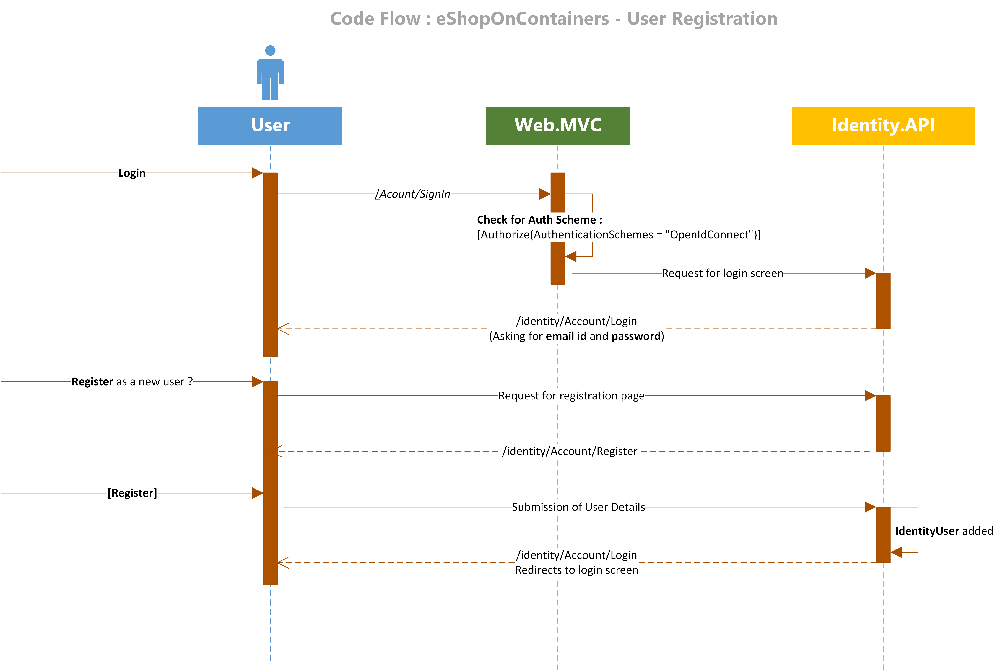
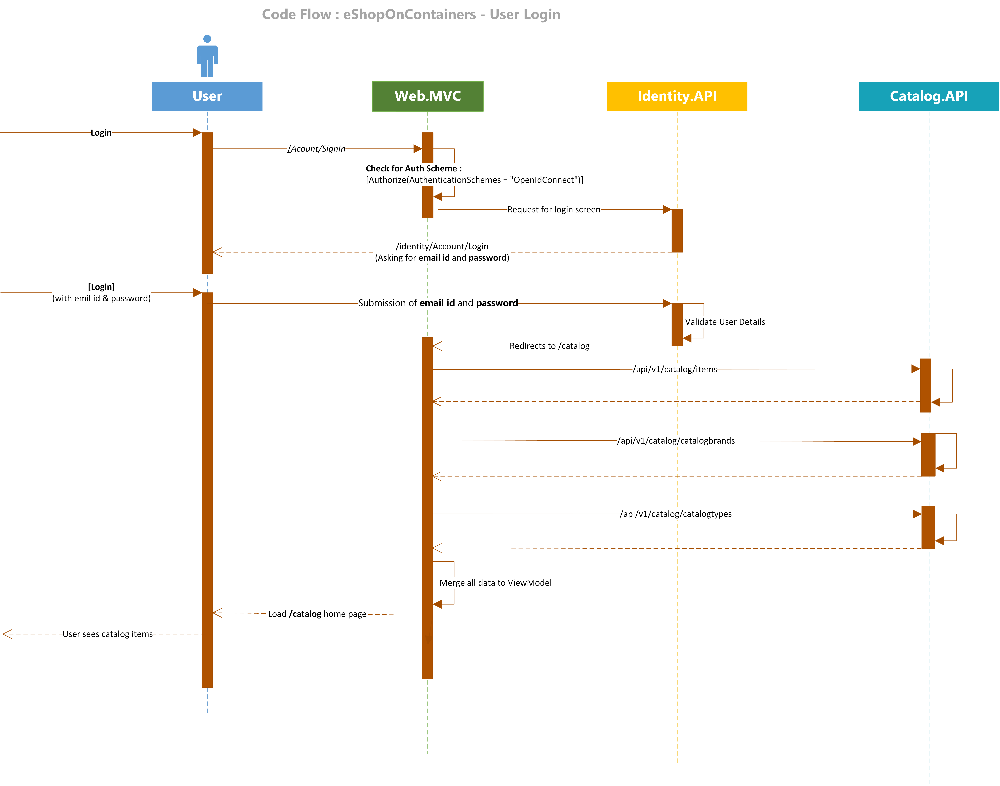

> **CONTENT**

- [Overview](#overview)
- [Code Flow](#Code-Flow)
    - [User Registration](#User-Registration)
    - [User Login](#User-Login)
    - [Add Item To Cart](#Add-Item-To-Cart)
    - [Order Creation](#Order-Creation)

## Overview

This page covers the interaction between different components in  `eShopOnContainers`. Set up the code base in your local if you haven't done already :

- Setup your development system for [Windows](Windows-setup) or [Mac](Mac-setup)

Different functionalities of **eShopOnContainers** application has been captured in the following diagrams.

## Code Flow

>**IMPORTANT:** All the following interaction has been captured taking **Web.MVC** as reference. It may subject to change for **Web.SPA**

### User Registration

### User Login

### Add Item To Cart

### Order Creation

