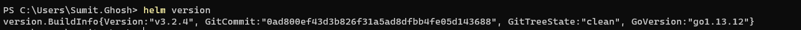

> **CONTENT**

- [Specifications](#specifications)
- [Previous Versions](#Previous-Versions)
- [Pre-Requisites](#Pre-Requisites)
  - [Valid Azure Subscription](#Valid-Azure-Subscription)
  - [Install PowerShell](#Install-PowerShell)
  - [Install Azure CLI](#Install-Azure-CLI)
  - [Install Kubectl](#Install-Kubectl)
- [Create The Kubernetes Cluster in AKS](#create-the-kubernetes-cluster-in-aks)
- [Configure Kubectl](#Configure-Kubectl)
- [Install Helm](#install-helm)
- [Install NGINX Ingress Controller](#Install-NGINX-Ingress-Controller)
- [Install eShopOnContainers Using Helm](#Install-eShopOnContainers-Using-Helm)
  - [Deploy Public Images From DockerHub](#Deploy-Public-Images-From-DockerHub)
  - [Deploy Your Local Images](#deploy-your-local-images)  
  - [Check Deployment Status](#Check-Deployment-Status)
- [Known Behaviours](#Known-Behaviours)
  - [Allow large headers (needed for login to work)](#allow-large-headers-needed-for-login-to-work)
- [Explore eShopOnContainers](#explore-eshoponcontainers)
- [Optional / Customize The Deployment](#Optional-/-Customize-The-Deployment)
  - [Delete Deployments](#Delete-Deployments)
  - [Configure RBAC security for K8s dashboard service-account](#configure-rbac-security-for-k8s-dashboard-service-account)
  - [Using Linkerd as Service Mesh (Advanced Scenario)](#using-linkerd-as-service-mesh-advanced-scenario)  
  - [Using Specific DNS](#using-specific-dns)
  - [Not deploying infrastructure containers](#not-deploying-infrastructure-containers)
  - [Providing your own configuration](#providing-your-own-configuration)
  - [Using Azure storage for Catalog Photos](#using-azure-storage-for-catalog-photos)


## Specifications 

We have upgraded K8s scripts to work on the latest versions of *Kubernetes* with AKS. Current `dev` branch has been tested with the following specifications :

| Component                | Versions |
|--------------------------|----------|
| Azure CLI                | 2.9.1    |
| kubectl                  | 1.16     |
| Kubernetes Services      | AKS      |
| Container Registry       | ACS      |
| Kubernetes Version       | 1.16.10  |
| Kubernetes-Dashboard     | 2.0      |
| Helm                     | 3.2.4    |
| Nginx Ingress controller | 0.20     |
| Nginx                    | 1.15     |

## Previous Versions

You can still refer old version of kubernetes related scripts under **k8s/archived** directory. For more details, please visit [archived page](Deploy-to-Azure-Kubernetes-Service-(AKS)-Archived).

**IMPORTANT:** Directory `k8s/archived` will not be supported in the future.


## Pre-Requisites

### Install PowerShell
If you don't have `powershell` on your machine you can get that from the [official documentation](https://docs.microsoft.com/en-us/powershell/scripting/install/installing-powershell?view=powershell-7)

**Note:** If you want you can use `bash` shell as well for the deployment.

### Valid Azure Subscription

If you already have an access to Azure Subscription that's good or else, signup for a [free account](https://azure.microsoft.com/en-us/free/)

### Install Azure CLI

You can follow [official documentation](https://docs.microsoft.com/en-us/cli/azure/install-azure-cli?view=azure-cli-latest) to complete the installation.

### Install Kubectl

If you already don't have `kubectl` tool in your local machine you can install that using this [official documentation](https://kubernetes.io/docs/tasks/tools/install-kubectl/).

## Create The Kubernetes Cluster in AKS

You can create the AKS cluster by using two ways:

- **A.** Use Azure CLI: Follow a procedure using [Azure CLI like here](https://docs.microsoft.com/en-us/azure/aks/kubernetes-walkthrough), but you need to make sure you of the following items :
  - **enable RBAC** with `--enable-rbac` 
  - **enable application routing** with `--enable-addons http_application_routing` in `az aks create` command.

- **B.** Use Azure's portal

The following steps are using the Azure portal to create the AKS cluster:

- Start the process by providing the general data, like in the following screenshot:

  /create-k8s-cluster-basics-latest.png)

- Select default node pool related settings:

  /create-k8s-cluster-node-pools-latest.png)

- Then important is to set authentication method and enable RBAC:

  /create-k8s-cluster-auth-latest.png)

- To **Enable http routing** make sure to check the checkbox "Http application routing" on "Networking" settings. For more info, read the [documentation](https://docs.microsoft.com/en-us/azure/aks/http-application-routing)

    You can use **basic network** settings since for a test you don't need integration into any existing VNET.

  /create-k8s-cluster-basic-http-routing-latest.png)

    **Note:** In case if you have missed out on setting **http routing** during the creation of the cluster, you would need to run below command once the cluster is up and running.

    ```powershell
    az aks enable-addons -a http_application_routing -g <resource-group-name> -n <aks-cluster-name>
    ```

- You can also enable monitoring:

  /create-k8s-cluster-monitoring.png)
  
  **Note:** You can choose your preconfigured *Azure Container Registry* as well but for that in the "Authentication" configuration step you would need to choose an authentication method as "System-assigned managed identity". For e.g :

  /create-k8s-cluster-auth-system-mi.png)

- Finally once all validations are passed, create the cluster. It'll take a few minutes for it to be ready.

  /create-k8s-cluster-final.png)  

## Configure Kubectl 

Once the cluster is up and running, you'll need to configure your local `kubectl` tool to access AKS cluster. You can do that by running the following command. 

```powershell
az aks get-credentials --resource-group <resource-group-name> --name <k8s-cluster-name>
```
**Note** Check your `kubectl` configuration to see if it's pointing to the correct cluster context. You can do that using the below command. 

```powershell
kubectl config get-contexts
```

## Install Helm

[Helm](https://helm.sh/) is the package manager for Kubernetes.

- For detailed installation steps, please refer [official documentation page](https://helm.sh/docs/intro/install/).

- After successful installation, `helm` version can be seen as per below :

  

Please note, `helm 3` onwards **Tiller Server** component has been removed. So you wouldn't need to install client and server separately.

## Install NGINX Ingress Controller

[Ingress](https://kubernetes.io/docs/concepts/services-networking/ingress/) is an API object that allows access to your clustered services from the outside. It's like a reverse proxy, that can handle load balancing, TLS, virtual hosting and the like.

[NGINX](https://github.com/kubernetes/ingress-nginx/blob/master/README.md) is the Ingress controller used for eShopOnContainers.

To install the NGINX Ingress controller, run the following commands from the **deploy/k8s/nginx-ingress** folder:


```powershell
kubectl apply -f mandatory.yaml
kubectl apply -f local-cm.yaml
kubectl apply -f local-svc.yaml
```

## Install eShopOnContainers Using Helm

Go to the **deploy/k8s/helm** folder in your local copy of the eShopOnContainers repo.

At this point you have two options for installing eShopOnContainers:

1. Use the [public images from DockerHub (eshop)](https://hub.docker.com/u/eshop/) with tag `linux-dev` 
2. **Or** Use your local images with tag `linux-latest`  

### Deploy Public Images From DockerHub

The easiest way to setup *eshop* on AKS is to use public images. For that you would require to run below scripts:
  
  - For Windows :

    ```powershell
    .\deploy-all.ps1 -externalDns aks -aksName <aks-cluster-name> -aksRg <resource-group-name> -imageTag linux-dev -useMesh $false
    ```

  - For Mac :

    ```powershell
    .\deploy-all-mac.ps1 -externalDns aks -aksName <aks-cluster-name> -aksRg <resource-group-name> -imageTag linux-dev -useMesh $false    
    ```

### Deploy Your Local Images

If you have done some local changes in the *eshop* application and want to deploy that to the cluster, you can do that by building and publishing your local docker images to your private container registry.

- Setup a container registry. In this scenario `ACS` has been used.

  /create-acs-validation-final-step.png)

  Alternatively, you can use [Azure CLI to set up ACS](https://docs.microsoft.com/en-us/azure/container-registry/container-registry-get-started-azure-cli)

- Go to the `src` directory of your local repo and below command :

  ```powershell
  docker-compose build
  ```
- Login to your container registry. 

  ```powershell
  docker login <container-registry-name>.azurecr.io
  ```

- Then tag those images and publish them to the `ACS registry`.

  ```powershell
  docker tag eshop/mobileshoppingagg:linux-latest <acs-registry-name>.azurecr.io/eshop/mobileshoppingagg:linux-lates
  docker tag eshop/ordering.signalrhub:linux-latest <acs-registry-name>.azurecr.io/eshop/ordering.signalrhub:linux-lates
  ....
  ....
  ```

  ```powershell
  docker push <acs-registry-name>.azurecr.io/eshop/mobileshoppingagg:linux-latest
  docker push <acs-registry-name>.azurecr.io/eshop/ordering.signalrhub:linux-latest
  ....
  ....
  ```

- After completion, your container registry should look like below :

  /acs-repositories-latest.png)

- To use your own images instead of the public ones, you have to pass following additional parameters to the `deploy-all.ps1` script:

  * `registry`: Login server for the Docker registry
  * `dockerUser`: User login for the Docker registry
  * `dockerPassword`: User password for the Docker registry

  For e.g :

  -  Windows :

    ```powershell
    .\deploy-all.ps1 -externalDns aks -aksName <aks-cluster-name> -aksRg <resource-group> -imageTag linux-latest -registry <container-registry>.azurecr.io -dockerUser <container-registry-user-name> -dockerPassword <container-registry-user-password> -useMesh $false
    ```

  -  Mac :

    ```powershell
    .\deploy-all-mac.ps1 -externalDns aks -aksName <aks-cluster-name> -aksRg <resource-group> -imageTag linux-latest -registry <container-registry>.azurecr.io -dockerUser <container-registry-user-name> -dockerPassword <container-registry-user-password> -useMesh $false    
    ```

### Check Deployment Status

Once the script is run, you should see following output when using `kubectl get deployment`:

```console
NAME                             READY   UP-TO-DATE   AVAILABLE   AGE
eshop-apigwmm                    1/1     1            1           29d
eshop-apigwms                    1/1     1            1           29d
eshop-apigwwm                    1/1     1            1           29d
eshop-apigwws                    1/1     1            1           29d
eshop-basket-api                 1/1     1            1           30d
eshop-basket-data                1/1     1            1           30d
eshop-catalog-api                1/1     1            1           30d
eshop-identity-api               1/1     1            1           30d
eshop-keystore-data              1/1     1            1           30d
eshop-locations-api              1/1     1            1           30d
eshop-marketing-api              1/1     1            1           30d
eshop-mobileshoppingagg          1/1     1            1           30d
eshop-nosql-data                 1/1     1            1           30d
eshop-ordering-api               1/1     1            1           30d
eshop-ordering-backgroundtasks   1/1     1            1           30d
eshop-ordering-signalrhub        1/1     1            1           30d
eshop-payment-api                1/1     1            1           30d
eshop-rabbitmq                   1/1     1            1           30d
eshop-sql-data                   1/1     1            1           30d
eshop-webhooks-api               1/1     1            1           30d
eshop-webhooks-web               1/1     1            1           30d
eshop-webmvc                     1/1     1            1           30d
eshop-webshoppingagg             1/1     1            1           30d
eshop-webspa                     1/1     1            1           30d
eshop-webstatus                  1/1     1            1           30d
```

Every public service is exposed through its own ingress resource, as you can see if using `kubectl get ing`:

```console
eshop-apigwmm        eshop.<your-guid>.<region>.aksapp.io   <public-ip>   80        4d
eshop-apigwms        eshop.<your-guid>.<region>.aksapp.io   <public-ip>   80        4d
eshop-apigwwm        eshop.<your-guid>.<region>.aksapp.io   <public-ip>   80        4d
eshop-apigwws        eshop.<your-guid>.<region>.aksapp.io   <public-ip>   80        4d
eshop-identity-api   eshop.<your-guid>.<region>.aksapp.io   <public-ip>   80        4d
eshop-webhooks-api   eshop.<your-guid>.<region>.aksapp.io   <public-ip>   80        4d
eshop-webhooks-web   eshop.<your-guid>.<region>.aksapp.io   <public-ip>   80        4d
eshop-webmvc         eshop.<your-guid>.<region>.aksapp.io   <public-ip>   80        4d
eshop-webspa         eshop.<your-guid>.<region>.aksapp.io   <public-ip>   80        4d
eshop-webstatus      eshop.<your-guid>.<region>.aksapp.io   <public-ip>   80        4d
```

**Note:** Ingresses are automatically configured to use the public DNS of the AKS provided by the "https routing" addon.

## Known Behaviours

### Allow Large Headers (*needed for login to work*)

One step more is needed: we need to configure the nginx ingress controller that AKS has to allow larger headers. This is because the headers sent by the identity server exceed the size configured by default. Fortunately this is very easy to do. Just type (from the `/k8s/helm` folder):

```powershell
kubectl apply -f aks-httpaddon-cfg.yaml
```

Then you can restart the pod that runs the nginx controller. Its name is `addon-http-application-routing-nginx-ingress-controller-<something>` and runs on `kube-system` namespace. So run a `kubectl get pods -n kube-system` find it and delete with `kubectl delete pod <pod-name> -n kube-system`.

**Note:** If running in a bash shell you can type:

```powershell
kubectl delete pod $(kubectl get pod -l app=addon-http-application-routing-nginx-ingress -n kube-system -o jsonpath="{.items[0].metadata.name}) -n kube-system
```

## Explore eShopOnContainers

After a while, when all services are running OK, you should get to see something like this:

/aks-eshop-webstatus.png)

- WebStatus: `http://[eshop.<your-guid>.<region>.aksapp.io]/webstatus`
- WebMVC: `http://[eshop.<your-guid>.<region>.aksapp.io]/webmvc`
- WebSPA: `http://[eshop.<your-guid>.<region>.aksapp.io]/`

## Optional / Customize The Deployment

### Delete Deployments

To delete *eShop* related deployments you can use this command:

```powershell
helm uninstall $(helm ls --filter eshop -q)
```

Before performing actual delete if you want to perform a dry run, below command is useful. 

```powershell
helm uninstall $(helm ls --filter eshop -q) --dry-run
```

### Configure RBAC security for K8s dashboard service-account

In order NOT to get errors in the Kubernetes dashboard, you'll need to set the following service-account steps.

Here you can see the errors you might see:
/rbac-kubernetes-dashboard.png)

- Because the cluster is using RBAC, you need to grant needed rights to the Service Account `kubernetes-dashboard` with this kubectl command:

`kubectl create clusterrolebinding kubernetes-dashboard -n kube-system --clusterrole=cluster-admin --serviceaccount=kube-system:kubernetes-dashboard`


Now, just run the Azure CLI command to browse the Kubernetes Dashboard:

`az aks browse --resource-group pro-eshop-aks-helm-linux-resgrp --name pro-eshop-aks-helm-linux`

/kubernetes-dashboard.png)


### Using Linkerd as Service Mesh (Advanced Scenario)

There is the possibility to install eShopOnContainers ready to run with the [Linkerd](https://linkerd.io/) [Service Mesh](./Resiliency-and-Service-Mesh.md). To use Linkerd, you must complete the following steps:

1. Install Linkerd on your cluster. The process is described in the [Linkerd installation documentation](https://linkerd.io/2/getting-started/#step-0-setup). Steps 0 trough 3 need to be done.
2. Then install eShopOnContainers as per the procedure described above, but using this command:
    ```powershell
    .\deploy-all.ps1 -externalDns aks -aksName <aks-cluster-name> -aksRg <resource-group-name> -imageTag linux-dev -useMesh $true
    ```

Once eShop is installed you can check that all non-infrastructure pods have two containers:

/pods.png)

Now you can use the command `linkerd dashboard` to show the mesh and monitor all the connections between eShopOnContainer pods.

The mesh monitors all HTTP connections (including gRPC), but don't monitor RabbitMQ or any other connection (SQL, Mongo, ...)

For more information read the [Resiliency and Service Mesh](./Resiliency-and-Service-Mesh.md) page in the wiki.

### Using Specific DNS

The `-externalDns` parameter controls the DNS bounded to ingresses. You can pass a custom DNS (like `my.server.com`), or the `aks` value to autodiscover the AKS DNS. For autodiscover to work you also need to pass which AKS is, using the `-aksName` and `-aksRg` parameters.
Autodiscovering works using Azure CLI under the hood, so ensure that Azure CLI is logged and pointing to the right subscription.

If you don't pass any external DNS at all, ingresses isn't bound to any DNS, and you have to use public IP to access the resources.

### Not deploying infrastructure containers

If you want to use external resources, use `-deployInfrastructure $false` to not deploy infrastructure containers. However **you still have to manually update the scripts to provide your own configuration** (see next section).

### Providing your own configuration

The file `inf.yaml` contains the description of the infrastructure used. That file is documented so take a look at it to understand all of its entries. If using external resources you need to edit this file according to your needs. You'll need to edit:

* `inf.sql.host` with the host name of the SQL Server
* `inf.sql.common` entries to provide your SQL user, password. `Pid` is not used when using external resources (it is used to set specific product id for the SQL Server container).
* `inf.sql.catalog`, `inf.sql.ordering`, `inf.sql.identity`: To provide the database names for catalog, ordering and identity services
* `mongo.host`: With the host name of the Mongo DB
* `mongo.locations`, `mongo.marketing` with the database names for locations and marketing services
* `redis.basket.constr` with the connection string to Redis for Basket Service. Note that `redis.basket.svc` is not used when using external services
* `redis.keystore.constr` with the connection string to Redis for Keystore Service. Note that `redis.keystore.svc` is not used when using external services
* `eventbus.constr` with the connection string to Azure Service Bus and `eventbus.useAzure` to `true` to use Azure service bus. Note that `eventbus.svc` is not used when using external services

### Using Azure storage for Catalog Photos

Using Azure storage for catalog (and marketing) photos is not directly supported, but you can accomplish it by editing the file `k8s/helm/catalog-api/templates/configmap.yaml`. Search for lines:

```
catalog__PicBaseUrl: http://{{ $webshoppingapigw }}/api/v1/c/catalog/items/[0]/pic/
```

And replace it for:

```
catalog__PicBaseUrl: http://<url-of-the-storage>/
```

In the same way, to use Azure storage for the marketing service, have to edit the file `k8s/helm/marketing-api/templates/configmap.yaml` and replacing the line:

```
marketing__PicBaseUrl: http://{{ $webshoppingapigw }}/api/v1/c/catalog/items/[0]/pic/
```

by:

```
marketing__PicBaseUrl: http://<url-of-the-storage>/
```
