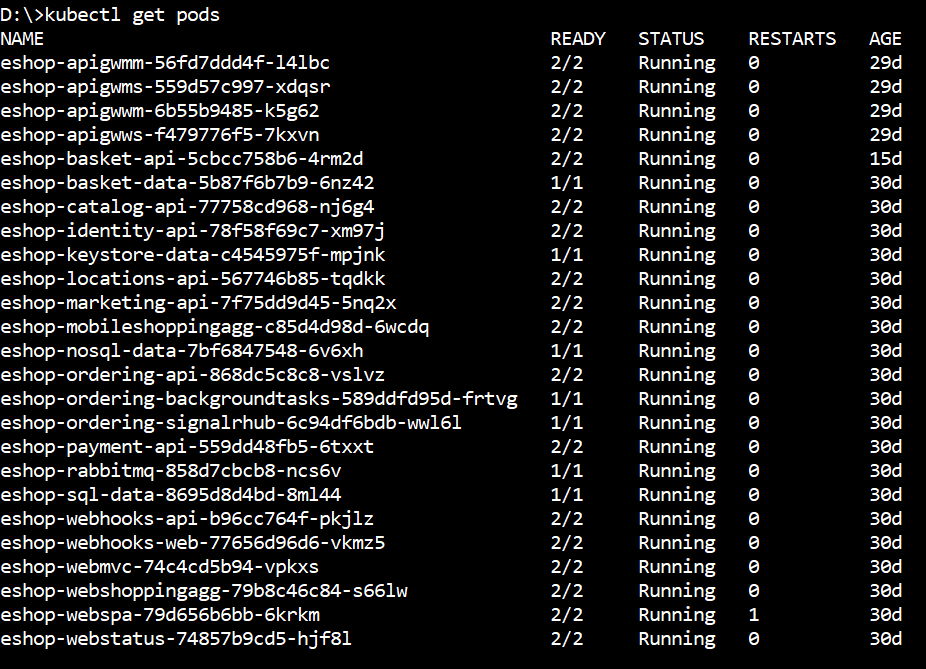

> **CONTENT**

- [Create Kubernetes cluster in AKS](#create-kubernetes-cluster-in-aks)
- [Configure RBAC security for K8s dashboard service-account](#configure-rbac-security-for-k8s-dashboard-service-account)
- [Additional pre-requisites](#additional-pre-requisites)
  - [Install Helm](#install-helm)
- [Install eShopOnContainers using Helm](#install-eshoponcontainers-using-helm)
- [Customizing the deployment](#customizing-the-deployment)
  - [Using your own images](#using-your-own-images)
  - [Using specific DNS](#using-specific-dns)
  - [Not deploying infrastructure containers](#not-deploying-infrastructure-containers)
  - [Providing your own configuration](#providing-your-own-configuration)
  - [Using Azure storage for Catalog Photos](#using-azure-storage-for-catalog-photos)

It's possible to deploy eShopOnContainers on a AKS using [Helm](https://helm.sh/) instead of custom scripts (that will be deprecated soon).

## Create Kubernetes cluster in AKS

You can create the AKS cluster by using two ways:

- A. Use Azure CLI: Follow a procedure suing [Azure CLI like here](https://docs.microsoft.com/en-us/azure/aks/kubernetes-walkthrough), but make sure you **enable RBAC** with `--enable-rbac` and **enable application routing** with `--enable-addons http_application_routing` in `az aks create` command.

- B. Use Azure's portal

The following steps are using the Azure portal to create the AKS cluster:

- Start the process by providing the general data, like in the following screenshot:


- Then, very important, in the next step, enable RBAC:


- **Enable http routing**. Make sure to check the checkbox "Http application routing" on "Networking" settings. For more info, read the [documentation](https://docs.microsoft.com/en-us/azure/aks/http-application-routing)

    You can use **basic network** settings since for a test you don't need integration into any existing VNET.


- You can also enable monitoring:


- Finally, create the cluster. It'll take a few minutes for it to be ready.

## Configure RBAC security for K8s dashboard service-account

In order NOT to get errors in the Kubernetes dashboard, you'll need to set the following service-account steps.

Here you can see the errors you might see:


- Because the cluster is using RBAC, you need to grant needed rights to the Service Account `kubernetes-dashboard` with this kubectl command:

`kubectl create clusterrolebinding kubernetes-dashboard -n kube-system --clusterrole=cluster-admin --serviceaccount=kube-system:kubernetes-dashboard`


Now, just run the Azure CLI command to browse the Kubernetes Dashboard:

`az aks browse --resource-group pro-eshop-aks-helm-linux-resgrp --name pro-eshop-aks-helm-linux`


## Additional pre-requisites

In addition to having an AKS cluster created in Azure and having kubectl and Azure CLI installed in your local machine and configured to use your Azure subscription, you also need the following pre-requisites:

### Install Helm

You need to have helm installed on your machine, and Tiller must be installed on the AKS. Follow these instructions on how to ['Install applications with Helm in Azure Kubernetes Service (AKS)'](https://docs.microsoft.com/en-us/azure/aks/kubernetes-helm) to setup Helm and Tiller for AKS.

**Note**: If your ASK cluster is not RBAC-enabled (default option in portal) you may receive following error when running a helm command:

```
Error: Get http://localhost:8080/api/v1/namespaces/kube-system/configmaps?labelSelector=OWNER%!D(MISSING)TILLER: dial tcp [::1]:8080: connect: connection refused
```

If so, type:

```
kubectl --namespace=kube-system edit deployment/tiller-deploy
```

Your default text editor will popup with the YAML definition of the tiller deploy. Search for:

```
automountServiceAccountToken: false
```

And change it to:

```
automountServiceAccountToken: true
```

Save the file and close the editor. This should reapply the deployment in the cluster. Now Helm commands should work.

## Install eShopOnContainers using Helm

All steps need to be performed on `/k8s/helm` folder. The easiest way is to use the `deploy-all.ps1` script from a Powershell window:

```
.\deploy-all.ps1 -externalDns aks -aksName eshoptest -aksRg eshoptest -imageTag dev -useMesh $false
```

This will install all the [eShopOnContainers public images](https://hub.docker.com/u/eshop/) with tag `dev` on the AKS named `eshoptest` in the resource group `eshoptest`. By default all infrastructure (sql, mongo, rabbit and redis) is installed also in the cluster.

Once the script is run, you should see following output when using `kubectl get deployment`:

```
NAME                             READY   UP-TO-DATE   AVAILABLE   AGE
eshop-apigwmm                    1/1     1            1           29d
eshop-apigwms                    1/1     1            1           29d
eshop-apigwwm                    1/1     1            1           29d
eshop-apigwws                    1/1     1            1           29d
eshop-basket-api                 1/1     1            1           30d
eshop-basket-data                1/1     1            1           30d
eshop-catalog-api                1/1     1            1           30d
eshop-identity-api               1/1     1            1           30d
eshop-keystore-data              1/1     1            1           30d
eshop-locations-api              1/1     1            1           30d
eshop-marketing-api              1/1     1            1           30d
eshop-mobileshoppingagg          1/1     1            1           30d
eshop-nosql-data                 1/1     1            1           30d
eshop-ordering-api               1/1     1            1           30d
eshop-ordering-backgroundtasks   1/1     1            1           30d
eshop-ordering-signalrhub        1/1     1            1           30d
eshop-payment-api                1/1     1            1           30d
eshop-rabbitmq                   1/1     1            1           30d
eshop-sql-data                   1/1     1            1           30d
eshop-webhooks-api               1/1     1            1           30d
eshop-webhooks-web               1/1     1            1           30d
eshop-webmvc                     1/1     1            1           30d
eshop-webshoppingagg             1/1     1            1           30d
eshop-webspa                     1/1     1            1           30d
eshop-webstatus                  1/1     1            1           30d
```

Every public service is exposed through its own ingress resource, as you can see if using `kubectl get ing`:

```
eshop-apigwmm        eshop.<your-guid>.<region>.aksapp.io   <public-ip>   80        4d
eshop-apigwms        eshop.<your-guid>.<region>.aksapp.io   <public-ip>   80        4d
eshop-apigwwm        eshop.<your-guid>.<region>.aksapp.io   <public-ip>   80        4d
eshop-apigwws        eshop.<your-guid>.<region>.aksapp.io   <public-ip>   80        4d
eshop-identity-api   eshop.<your-guid>.<region>.aksapp.io   <public-ip>   80        4d
eshop-webhooks-api   eshop.<your-guid>.<region>.aksapp.io   <public-ip>   80        4d
eshop-webhooks-web   eshop.<your-guid>.<region>.aksapp.io   <public-ip>   80        4d
eshop-webmvc         eshop.<your-guid>.<region>.aksapp.io   <public-ip>   80        4d
eshop-webspa         eshop.<your-guid>.<region>.aksapp.io   <public-ip>   80        4d
eshop-webstatus      eshop.<your-guid>.<region>.aksapp.io   <public-ip>   80        4d
```

Ingresses are automatically configured to use the public DNS of the AKS provided by the "https routing" addon.

### Allow large headers (needed for login to work)

One step more is needed: we need to configure the nginx ingress controller that AKS has to allow larger headers. This is because the headers sent by identity server exceed the size configured by default. Fortunately this is very easy to do. Just type (from the `/k8s/helm` folder):

```
kubectl apply -f aks-httpaddon-cfg.yaml 
```

Then you can restart the pod that runs the nginx controller. Its name is `addon-http-application-routing-nginx-ingress-controller-<something>` and runs on `kube-system` namespace. So run a `kubectl get pods -n kube-system` find it and delete with `kubectl delete pod <pod-name> -n kube-system`.

**Note:** If running in a bash shell you can type:

```
kubectl delete pod $(kubectl get pod -l app=addon-http-application-routing-nginx-ingress -n kube-system -o jsonpath="{.items[0].metadata.name}) -n kube-system
```

You can view the MVC client at `http://[dns]/webmvc` and the SPA at the `http://[dns]/`

## Using Linkerd as Service Mesh (Advanced Scenario)

There is the possibility to install eShopOnContainers ready to run with [Linkerd](https://linkerd.io/) Service Mesh. To use Linkerd, you must follow the following steps:

1. Install Linkerd on your cluster. We don't provide Linkerd installation scripts, but the process is described in the [Linkerd installation documentation](https://linkerd.io/2/getting-started/#step-0-setup). Steps 0 trough 3 needs to be completed.
2. Then install eShopOnContainers using the procedure described above, but in the `deploy-all.ps1` pass the parameter `useMesh` to `$true`.

Once eShop is installed you can check that all non-infrastructure pods have two containers:



Now you can use the command `linkerd dashboard` to show the mesh and monitor all the connections between eShopOnContainer pods.

The mesh monitors all HTTP connections (including gRPC), but do not monitor RabbitMq or any other connection (SQL, Mongo, ...)

For more information read the [Resiliency and Service Meh](./Resiliency-and-mesh.md) page.


## Customizing the deployment

### Using your own images

To use your own images instead of the public ones, you have to pass following additional parameters to the `deploy-all.ps1` script:

* `registry`: Login server for the Docker registry
* `dockerUser`: User login for the Docker registry
* `dockerPassword`: User password for the Docker registry

This will deploy a secret on the cluster to connect to the specified server, and all image names deployed will be prepended with `registry/` value.

### Using specific DNS

The `-externalDns` parameter controls the DNS bounded to ingresses. You can pass a custom DNS (like `my.server.com`), or the `aks` value to autodiscover the AKS DNS. For autodiscover to work you also need to pass which AKS is, using the `-aksName` and `-aksRg` parameters.
Autodiscovering works using Azure CLI under the hood, so ensure that Azure CLI is logged and pointing to the right subscription.

If you don't pass any external DNS at all, ingresses are'nt bound to any DNS, and you have to use public IP to access the resources.

### Not deploying infrastructure containers

If you want to use external resources, use `-deployInfrastructure $false` to not deploy infrastructure containers. However **you still have to manually update the scripts to provide your own configuration** (see next section).

### Providing your own configuration

The file `inf.yaml` contains the description of the infrastructure used. File is docummented so take a look on it to understand all of its entries. If using external resources you need to edit this file according to your needs. You'll need to edit:

* `inf.sql.host` with the host name of the SQL Server
* `inf.sql.common` entries to provide your SQL user, password. `Pid` is not used when using external resources (it is used to set specific product id for the SQL Server container).
* `inf.sql.catalog`, `inf.sql.ordering`, `inf.sql.identity`: To provide the database names for catalog, ordering and identity services
* `mongo.host`: With the host name of the Mongo DB
* `mongo.locations`, `mongo.marketing` with the database names for locations and marketing services
* `redis.basket.constr` with the connection string to Redis for Basket Service. Note that `redis.basket.svc` is not used when using external services
* `redis.keystore.constr` with the connection string to Redis for Keystore Service. Note that `redis.keystore.svc` is not used when using external services
* `eventbus.constr` with the connection string to Azure Service Bus and `eventbus.useAzure` to `true` to use Azure service bus. Note that `eventbus.svc` is not used when using external services

### Using Azure storage for Catalog Photos

Using Azure storage for catalog (and marketing) photos is not directly supported, but you can accomplish it by editing the file `k8s/helm/catalog-api/templates/configmap.yaml`. Search for lines:

```
catalog__PicBaseUrl: http://{{ $webshoppingapigw }}/api/v1/c/catalog/items/[0]/pic/
```

And replace it for:

```
catalog__PicBaseUrl: http://<url-of-the-storage>/
```

In the same way, to use Azure storage for the marketing service, have to edit the file `k8s/helm/marketing-api/templates/configmap.yaml` and replacing the line:

```
marketing__PicBaseUrl: http://{{ $webshoppingapigw }}/api/v1/c/catalog/items/[0]/pic/
```

by:

```
marketing__PicBaseUrl: http://<url-of-the-storage>/
```
