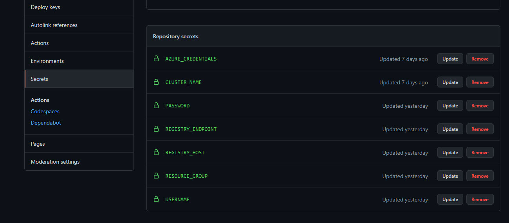
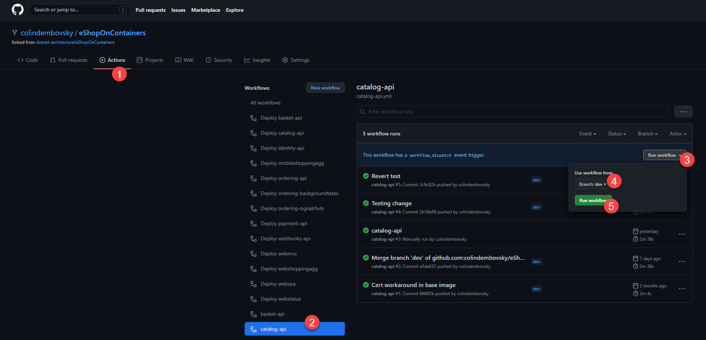
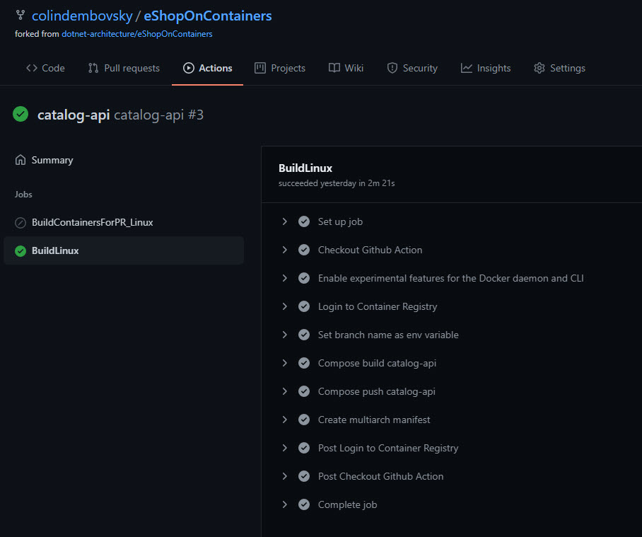
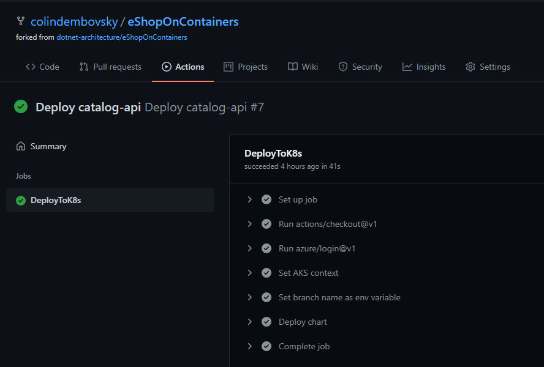
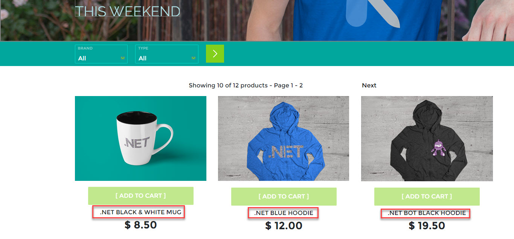
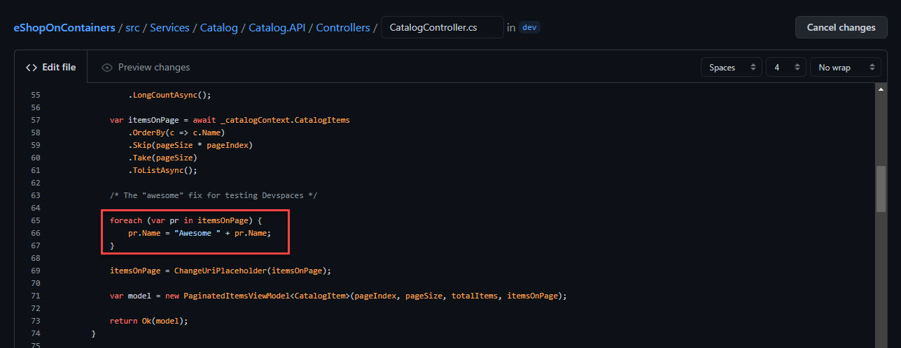
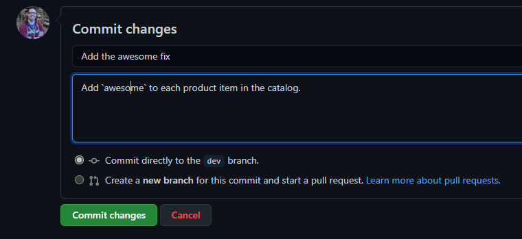
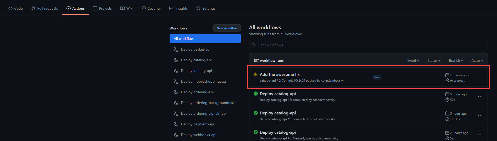
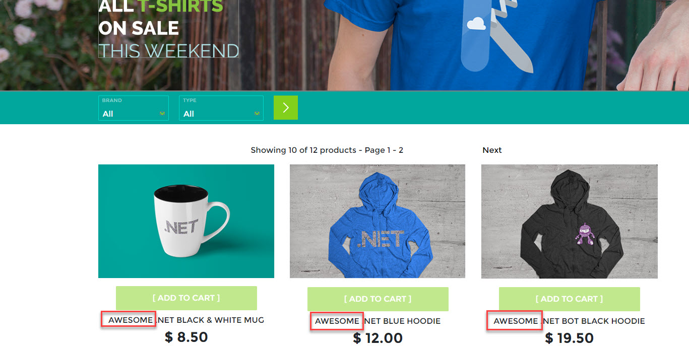

# Deploying to Azure Kubernetes Services using GitHub Actions

The [build page](https://github.com/dotnet-architecture/eShopOnContainers/wiki/GitHub-Actions) describes how Github Actions are used to build code for each of the `eShopOnContainers` microservices. These YAML files compile the code and create new container images which are pushed to a container registry. However, this does not deploy the container images to the Kubernetes cluster.

In this page, you will see how to utilize a deployment YAML file to deploy the newly pushed image to an existing cluster.

## Prerequisites

You will need the following:

- An Azure Container Registry (ACR)
- An Azure Kubernetes Service (AKS) cluster, with a [secure connection to the ACR](https://docs.microsoft.com/azure/aks/cluster-container-registry-integration#configure-acr-integration-for-existing-aks-clusters)
- An [NGINX Ingress Controller](https://github.com/dotnet-architecture/eShopOnContainers/wiki/Deploy-to-Azure-Kubernetes-Service-(AKS)#Install-NGINX-Ingress-Controller)
- Have [deployed eShopOnContainers](https://github.com/dotnet-architecture/eShopOnContainers/wiki/Deploy-to-Azure-Kubernetes-Service-(AKS)#Deploy-Public-Images-From-DockerHub)
- Optionally [configured allowing large headers](https://github.com/dotnet-architecture/eShopOnContainers/wiki/Deploy-to-Azure-Kubernetes-Service-(AKS)#allow-large-headers-needed-for-login-to-work)

> NOTE: You can deploy the AKS cluster and go through all the above steps by following the instructions in this [wiki](https://github.com/dotnet-architecture/eShopOnContainers/wiki/Deploy-to-Azure-Kubernetes-Service-(AKS)).

### Quickstart Script

If you do not have any infrastructure configured, you can create everything needed for this walkthrough by running the following script from the root of the `eShopOnContainers` repo:

```bash
export rg="<name of your resource group to create>"
export acr="<name of your container registry to create>"
export aks="<name of your AKS cluster to create>"
export spnName="<name of SPN to create>" # see below if you have an existing SPN

# create RG
az group create -n $rg --location southcentralus

# create ACR
az acr create -g $rg -n $acr --sku Basic --admin-enabled true
export acrId=$(az acr show -g $rg -n $acr --query "id" -o tsv)

# assign push/pull role to SPN
spnPassword=$(az ad sp create-for-rbac --name http://$spnName --scopes $acrId --role acrpush --query password --output tsv)
spnId=$(az ad sp show --id http://$spnName --query appId --output tsv)

# for an existing SPN
# export spnId="<id of an existing service principle>"
# az role assignment create --assignee $spnId --role acrpush --scope $acrId

# create AKS cluster
az aks create -g $rg -n $aks --node-count 1 --enable-addons monitoring,http_application_routing --enable-rbac --generate-ssh-keys --attach-acr $acr

az get-credentials -g $rg -n $aks

# deploy nginx controller
cd deploy/k8s/nginx-ingress
kubectl apply -f mandatory.yaml
kubectl apply -f local-cm.yaml
kubectl apply -f local-svc.yaml

# update nginx controller to allow large heaeders for login
cd -
cd deploy/k8s/helm
kubectl apply -f aks-httpaddon-cfg.yaml
kubectl delete pod $(kubectl get pod -l app=addon-http-application-routing-nginx-ingress -n kube-system -o jsonpath="{.items[0].metadata.name}") -n kube-system

cd -

# deploy all from public repos
cd deploy/k8s/helm
kubectl create ns eshop
./deploy-all.sh --dns aks --aks-name $aks --aks-rg $rg -t linux-latest

# fix versions for apigwms (envoy)
export domain="$(az aks show -n $aks -g $rg --query addonProfiles.httpApplicationRouting.config.HTTPApplicationRoutingZoneName -o tsv)"
export dns="$aks.$domain"

helm uninstall eshop-apigwms -n eshop
helm install "eshop-apigwms" --namespace eshop --set "ingress.hosts={$dns}" --values app.yaml --values inf.yaml --values ingress_values.yaml --set app.name=eshop --set inf.k8s.dns=$dns --set image.pullPolicy=Always apigwms

helm uninstall eshop-apigwws -n eshop
helm install "eshop-apigwws" --namespace eshop --set "ingress.hosts={$dns}" --values app.yaml --values inf.yaml --values ingress_values.yaml --set app.name=eshop --set inf.k8s.dns=$dns --set image.pullPolicy=Always apigwws

```

Ensure that everything looks good when you [check the deployment status](https://github.com/dotnet-architecture/eShopOnContainers/wiki/Deploy-to-Azure-Kubernetes-Service-(AKS)#check-deployment-status)

## Using GitHub Actions to deploy a microservice

Along with the build YAML file that builds and pushes the container image to the registry, there are also `-deploy.yml` files for each microservice.

Take a look at the `catalog-api-deploy.yml` file in the `.github/workflows` folder:

```yml
name: Deploy catalog-api

on:
  workflow_dispatch:
  repository_dispatch:
    types:
    - deploy
  workflow_run:
    workflows: ["catalog-api"]
    branches: [dev]
    types: [completed]

env:
  CHART: catalog-api
  NAMESPACE: eshop
  CHART_ROOT: deploy/k8s/helm

jobs:
  deploy-to-k8s:
    if: ${{ github.event_name == 'workflow_dispatch' || github.event_name == 'repository_dispatch' || github.event.workflow_run.conclusion == 'success' }}
    runs-on: ubuntu-latest

    steps:
      - uses: actions/checkout@v2

      - uses: azure/login@v1
        with:
          creds: ${{ secrets.AZURE_CREDENTIALS }}

      - uses: azure/aks-set-context@v1
        name: Set AKS context
        with:
          creds: '${{ secrets.AZURE_CREDENTIALS }}'
          cluster-name: ${{ secrets.CLUSTER_NAME }}
          resource-group: ${{ secrets.RESOURCE_GROUP }}
      
      - name: Set branch name as env variable
        run: |
          currentbranch=$(echo ${GITHUB_REF##*/})
          echo "running on $currentbranch"
          echo "BRANCH=$currentbranch" >> $GITHUB_ENV
        shell: bash
      
      - name: Deploy CHART
        run: |
          ./deploy-CHART.sh -c ${{ env.CHART }} --dns aks --aks-name ${{ secrets.CLUSTER_NAME }} --aks-rg ${{ secrets.RESOURCE_GROUP }} -r ${{ secrets.REGISTRY_HOST }} -t $TAG --NAMESPACE ${{ env.NAMESPACE }} --acr-connected
        env:
          TAG: ${{ env.BRANCH }}
        working-directory: ${{ env.CHART_ROOT }}
```

Note the following:

- The name of the workflow is `Deploy catalog-api`.
- This workflow has three triggers:.
    1. `workflow_dispatch` is for manually triggering a deployment.
    1. `repository_dispatch` is for triggering this workflow via the REST API.
    1. `workflow_run` triggers this workflow when runs of the `catalog-api` workflow run on `dev` and are `completed`.
- Some variables are defined inline under the `env` section.
- There is a single job called `deploy-to-k8s`.
- The job only executes if the trigger was manual or via the REST API or if it was a workflow run trigger, if the workflow run completed with a `success` status.
- The job checks out the repo.
- The job then logs into Azure using secret `AZURE_CREDENTIALS`.
- The job then sets the AKS context.
- The job works out what branch it is on.
- The job invokes the `deploy-chart.sh` script to deploy the chart to the AKS cluster, using the branch as the tag.

## Executing a deployment

In this section, you will make a change to the `catalog-api` service in the `dev` branch. The push to `dev` will trigger the workflow to compile and push a new container image to the repo. Once this completes, the deploy workflow will deploy the new container image via Helm.

### Configure secrets

The workflows require a number of secrets in order to work. Select the **Settings** tab on your repo and then select **Secrets**. Define the following repository secrets:

Secret Name|Description|Example
---|-------|---
`AZURE_CREDENTIALS`|`JSON` with credentials for a Service Principle with access to the container registry and AKS cluster|`{ 'clientId': "<app ID of SPN>", "clientSecret": "<SPN Key>", "tenantId": "<Azure tenant GUID>", "subscriptionId": "<Azure subscription ID>" }`
`CLUSTER_NAME`|Name of the AKS cluster|`myeshop`
`PASSWORD`|Admin password for ACR|Retrieve this from the container registry blade in the Azure portal
`REGISTRY_ENDPOINT`|Endpoint for container registry|FQDN of registry and container|`myeshopacr.azurecr.io/eshop`
`REGISTRY_HOST`|FQDN of registry|`myeshopacr.azurecr.io`
`RESOURCE_GROUP`|Name of resource group containing AKS cluster|`myeshop-rg`
`USERNAME`|Admin username for ACR (typically name of ACR)|`myeshopacr`

When you are done, the secrets should look something like this:


**Figure 1**: Repository secrets.

### Check workflows for the Catalog API

If you select the **Actions** tab on your repository, you may already have some Actions. If you forked the main repo, you will be prompted to enable the Actions - you can do so now.

Ensure that you see `catalog-api` and `Deploy catalog-api` in the list of workflows.

You can test that the workflow is working correctly by selecting the `catalog-api` workflow. Next, select **Run workflow** to manually trigger the workflow. Select the `dev` branch.


**Figure 2**: Triggering the catalog-api workflow manually.

Make sure that the `catalog-api` workflow completes successfully, which should in turn trigger the `Deploy catalog-api` workflow. Ensure that this workflow completes successfully too.


**Figure 3**: Catalog-api successful run.


**Figure 4**: Deploy catalog-api successful run.

Ensure that you can [navigate to the store front](https://github.com/dotnet-architecture/eShopOnContainers/wiki/Deploy-to-Azure-Kubernetes-Service-(AKS)#explore-eshoponcontainers) using the ingress URLs. Take note of the names of the first few items:


**Figure 5**: Store front displaying items.

## Release a code change

Now that you have verified that the build and deploy workflows are working, you can simply push code changes to `dev` and the workflows will deploy those changes.

### Make a code change

Navigate to `src/Services/Catalog/Catalog.API/Controllers/CatalogController.cs` on the `dev` branch. Scroll down to around line 63. Remove the comments `/*` and `*/` above and below the `foreach` loop:


**Figure 6**: Uncomment the for loop.

Scroll to the bottom of the page and commit the change directly to the `dev` branch, entering a commit message:


**Figure 7**: Commit the code change.

Select the **Actions** tab and ensure that a new workflow has triggered.


**Figure 8**: Workflow triggered by pushing to `dev`.

Once that workflow completes, you should see the deploy workflow trigger immediately:


**Figure 9**: Deploy workflow triggered after building completes.

After about a minute, navigate back to the store front and verify that the word `Awesome` appears in front of each catalog item:


**Figure 10**: ew code is running successfully.