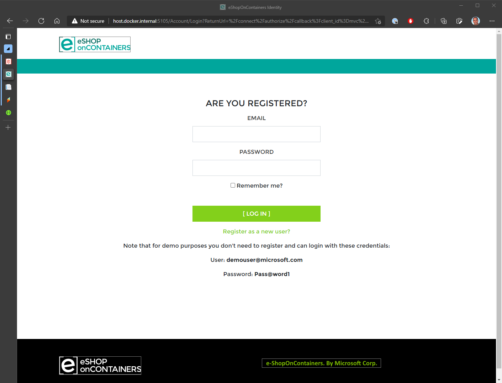
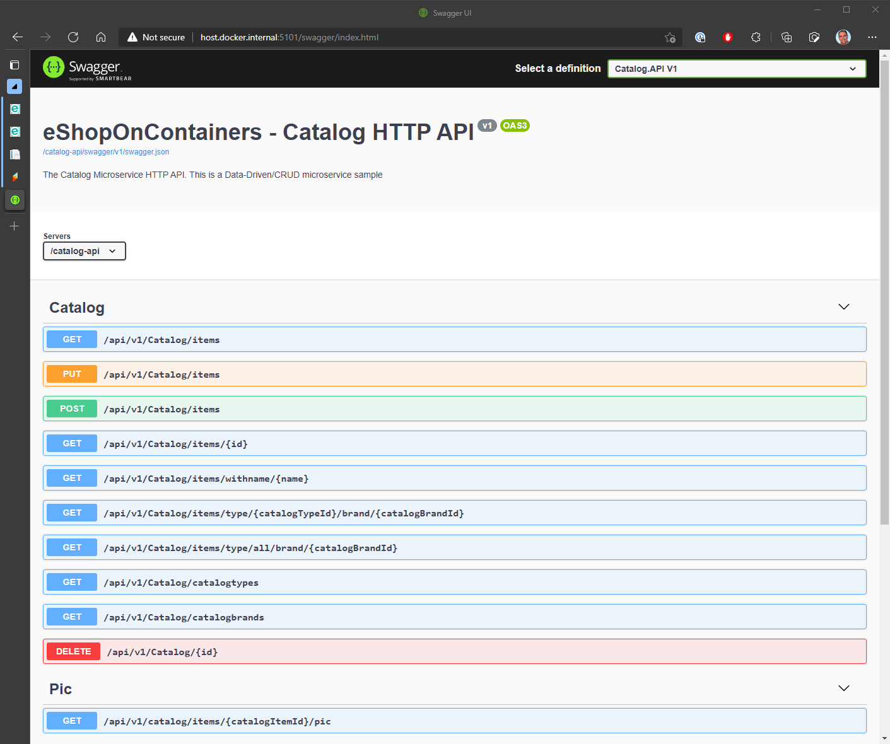
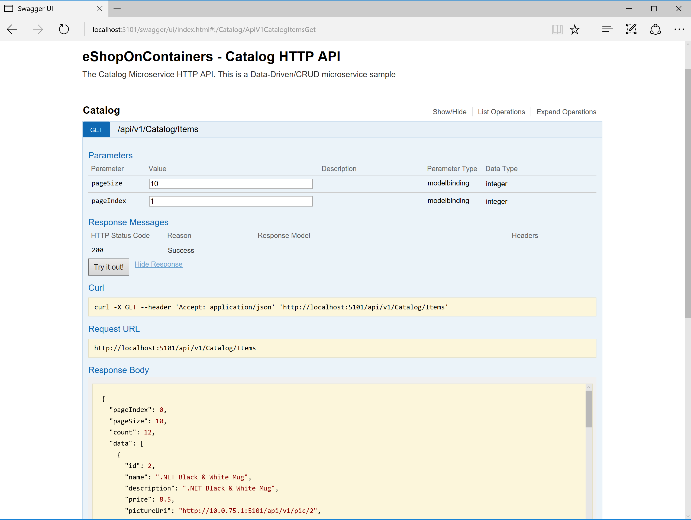

This page covers the exploration of the eShopOnContainers application and assumes you've already:

- Setup your development system for [Windows](Windows-setup) or [Mac](Mac-setup), at least up to the point of running eShopOnContainers from the CLI.

> **CONTENT**

- [MVC Web app](#mvc-web-app)
  - [Authenticating and creating an order on the Web MVC app](#authenticating-and-creating-an-order-on-the-web-mvc-app)
- [SPA Web app](#spa-web-app)
- [Swagger UI - REST API microservices - Catalog](#swagger-ui---rest-api-microservices---catalog)
- [Xamarin.Forms mobile apps for Android, iOS and Windows](#xamarinforms-mobile-apps-for-android-ios-and-windows)
- [All applications and microservices](#all-applications-and-microservices)

## MVC Web app

Open a browser and type <http://localhost:5100> and hit enter.
You should see the MVC application like in the following screenshot:

### Authenticating and creating an order on the Web MVC app

When you try the Web MVC application by using the url <http://localhost:5100>, you'll be able to test the home page which is also the catalog page. But if you want to add articles to the basket you need to login first at the login page which is handled by the STS microservice/container (Security Token Service). At this point, you could register your own user/customer or you can also use a convenient default user/customer named **demoUser@microsoft.com** so you don't need to register your own user and it'll be easier to explore.
The credentials for this demo user are:

- User: **demouser@microsoft.com**
- Password: **Pass@word1**

Below you can see the login page when providing those credentials.

## SPA Web app

While having the containers running, open a browser and type `http://localhost:5104/` and hit enter.
You should see the SPA application like in the following screenshot:

## Swagger UI - REST API microservices - Catalog

While having the containers running, open a browser and type `http://localhost:5101` and hit enter.
You should see the Swagger UI page for that microservice that allows you to test the Web API, like in the following screenshot:

Then, after providing the size (i.e. 10) and the current page (i.e. 1) for the data of the catalog, you can run the service hitting the "Try it out!" button and see the returned JSON Data:

## Xamarin.Forms mobile apps for Android, iOS and Windows

You can deploy the Xamarin app to real iOS, Android or Windows devices.
You can also test it on an Android Emulator based on Hyper-V like the Visual Studio Android Emulator (Do NOT install the Google's Android emulator or it will break Docker and Hyper-V, as mentioned in the [Windows setup page](Windows-setup)).

By default, the Xamarin app shows fake data from mock-services. In order to really access the microservices/containers in Docker from the mobile app, you need to:

- Disable mock-services in the Xamarin app by setting the <b>UseMockServices = false</b> in the App.xaml.cs and specify the host IP in  BaseEndpoint = "http://10.106.144.28" at the GlobalSettings.cs. Both files in the Xamarin.Forms project (PCL).
- Another alternative is to change that IP through the app UI, by modifying the IP address in the Settings page of the App as shown in the screenshot below. 
- In addition, you need to make sure that the used TCP ports of the services are open in the local firewall. 

   

## All applications and microservices

Once the containers are deployed, you should be able to access any of the services in the following URLs or connection string, from your dev machine:

- Web apps
  - Web MVC: <http://localhost:5100>
  - Web SPA: <http://localhost:5104>
  - Web Status: <http://localhost:5107>
- Microservices
  - Catalog microservice: <http://localhost:5101> (Not secured)
  - Ordering microservice: <http://localhost:5102> (Requires login - Click on Authorize button)
  - Basket microservice: <http://localhost:5103> (Requires login - Click on Authorize button)
  - Identity microservice: <http://localhost:5105> (View "discovery document")
- Infrastructure
  - SQL Server (connect with [SSMS](https://docs.microsoft.com/en-us/sql/ssms/download-sql-server-management-studio-ssms) to `tcp:localhost,5433` with `User Id=sa;Password=Pass@word;` and explore databases:
    - Identity: `Microsoft.eShopOnContainers.Service.IdentityDb`
    - Catalog: `Microsoft.eShopOnContainers.Services.CatalogDb`
    - Marketing: `Microsoft.eShopOnContainers.Services.MarketingDb`
    - Ordering: `Microsoft.eShopOnContainers.Services.OrdeingDb`
    - Webhooks: `Microsoft.eShopOnContainers.Services.WebhooksDb`
  - Redis (Basket data): install and run [redis-commander](https://www.npmjs.com/package/redis-commander) and explore in <http://localhost:8081/>
  - RabbitMQ (Queue management): <http://10.0.75.1:15672/> (login with username=guest, password=guest)
  - Seq (Logs collector): <http://10.0.75.1:5340>
