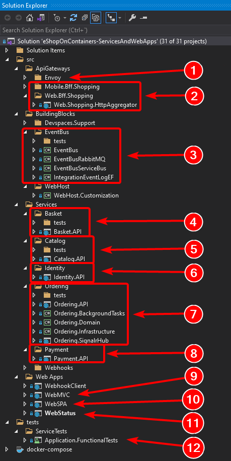
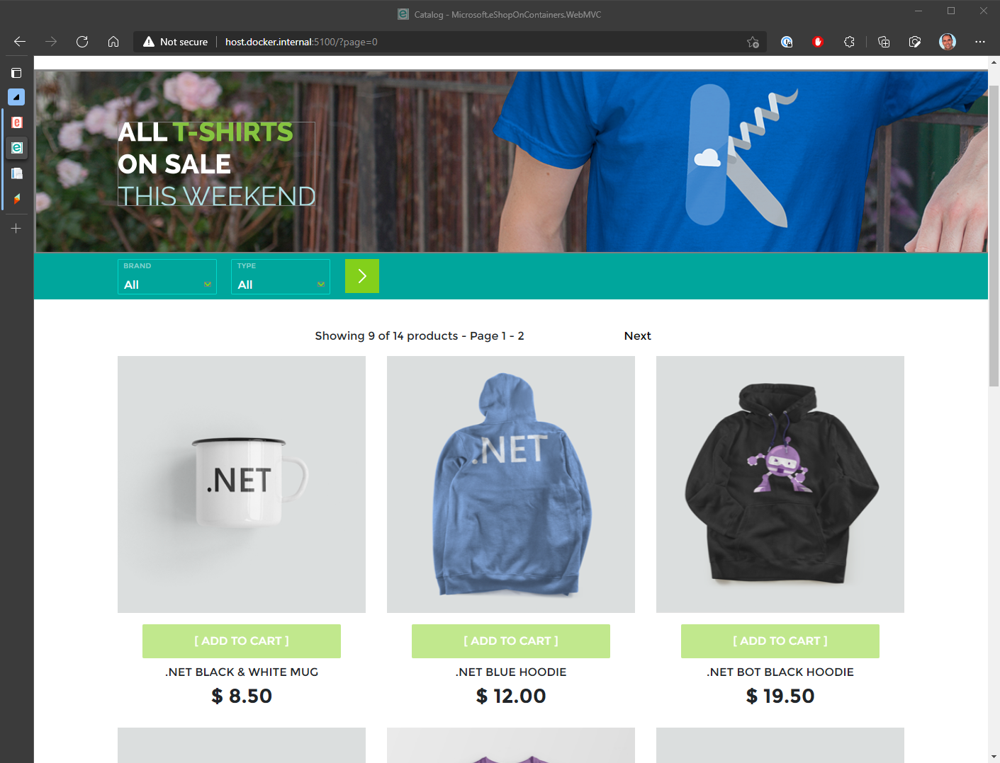

This page covers the exploration of eShopOnContainers' code base assumes you've already:

- Setup your development system for [Windows](Windows-setup) or [Mac](Mac-setup)

> **CONTENT**

- [Overview of the application code](#Overview-of-the-application-code)
- [MVC Application (ASP.NET Core)](#MVC-Application-ASPNET-Core)
- [SPA (Single Page Application)](#SPA-Single-Page-Application)
- [Xamarin Mobile App (For iOS, Android and Windows/UWP)](#Xamarin-Mobile-App-For-iOS-Android-and-WindowsUWP)
- [Additional resources](#Additional-resources)

## Overview of the application code

In this repo you can find a sample reference application that will help you to understand how to implement a microservice architecture based application using **.NET Core** and **Docker**.

The example business domain or scenario is based on an eShop or eCommerce which is implemented as a multi-container application. Each container is a microservice deployment (like the basket-microservice, catalog-microservice, ordering-microservice and the identity-microservice) which is developed using ASP.NET Core running on .NET Core so they can run either on Linux Containers and Windows Containers.
The screenshot below shows the VS Solution structure for those microservices/containers and client apps.

- (*Recommended when getting started*) Open **eShopOnContainers-ServicesAndWebApps.sln** for a solution containing just the server-side projects related to the microservices and web applications.
- Open **eShopOnContainers-MobileApps.sln** for a solution containing just the client mobile app projects (Xamarin mobile apps only). It works independently based on mocks, too.
- Open **eShopOnContainers.sln** for a solution containing all the projects (All client apps and services).

Finally, those microservices are consumed by multiple client web and mobile apps, as described below.

## MVC Application (ASP.NET Core)

It's an MVC application where you can find interesting scenarios on how to consume HTTP-based microservices from C# running in the server side, as it is a typical ASP.NET Core MVC application. Since it is a server-side application, access to other containers/microservices is done within the internal Docker Host network with its internal name resolution.

## SPA (Single Page Application)

Providing similar "eShop business functionality" but developed with Angular, Typescript and slightly using ASP.NET Core MVC. This is another approach for client web applications to be used when you want to have a more modern client behavior which is not behaving with the typical browser round-trip on every action but behaving like a Single-Page-Application which is more similar to a desktop app usage experience. The consumption of the HTTP-based microservices is done from TypeScript/JavaScript in the client browser, so the client calls to the microservices come from out of the Docker Host internal network (Like from your network or even from the Internet).

## Xamarin Mobile App (For iOS, Android and Windows/UWP)

It's a client mobile app supporting the most common mobile OS platforms (iOS, Android and Windows/UWP). In this case, the consumption of the microservices is done from C# but running on the client devices, so out of the Docker Host internal network (Like from your network or even the Internet).

## Additional resources

- **General setup and initial exploration** - [eShopOnContainers issue] \
  <https://github.com/dotnet-architecture/eShopOnContainers/issues/1032>

- **Why doesn't OrdersController follow common REST guidelines?**  - [eShopOnContainers issue] \
  <https://github.com/dotnet-architecture/eShopOnContainers/issues/1002>

- **How WebMVC calls Identity.API?** - [eShopOnContainers issue] \
  <https://github.com/dotnet-architecture/eShopOnContainers/issues/1043>

- **Login workflow does not work from mvc app to identity.api** - [eShopOnContainers issue] \
  <https://github.com/dotnet-architecture/eShopOnContainers/issues/1050>

- **How to use an external SQL Server machine?** - [eShopOnContainers issue] \
  <https://github.com/dotnet-architecture/eShopOnContainers/issues/172>

- **Using Ocelot Configuration.Json files in multiple projects for BFF framework** - [eShopOnContainers issue] \
  <https://github.com/dotnet-architecture/eShopOnContainers/issues/593>

- **Shared integration events** - [eShopOnContainers issue] \
  <https://github.com/dotnet-architecture/eShopOnContainers/issues/724>

- **There seems to be an atomicity issue while rising domain events in Ordering.Api** - [eShopOnContainers issue] \
  <https://github.com/dotnet-architecture/eShopOnContainers/issues/700>

- **Should the domain model be completely isolated?** - [eShopOnContainers issue] \
  <https://github.com/dotnet-architecture/eShopOnContainers/issues/869>

- **Event design and testing** - [eShopOnContainers issue] \
  <https://github.com/dotnet-architecture/eShopOnContainers/issues/924>
