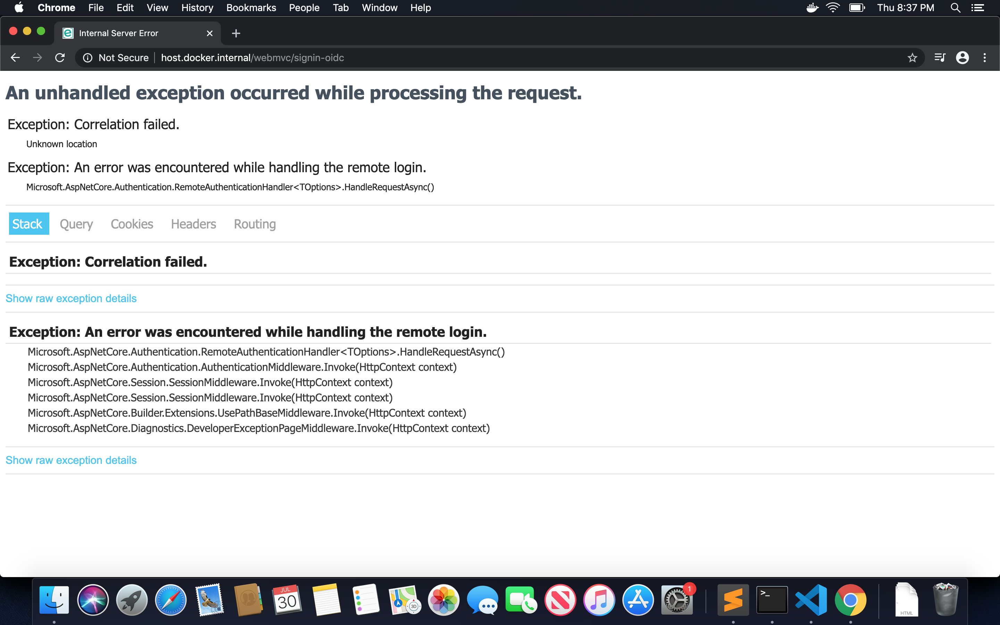
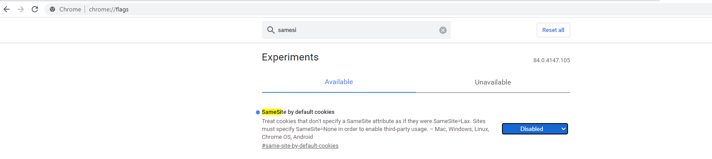
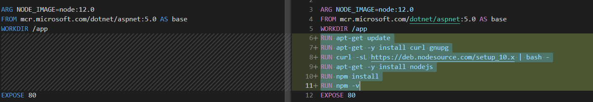
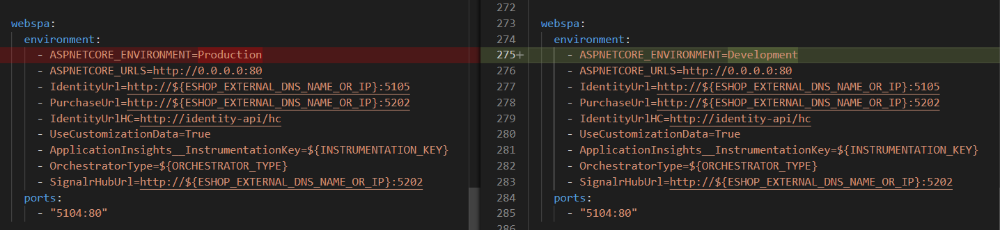

These are the most frequent errors encountered when running eShopOnContainers.

> **CONTENT**

- [Unauthorized_client when trying to log in from the MVC, the SPA application, or the Swagger UI API pages](#unauthorized_client-when-trying-to-log-in-from-the-mvc-the-spa-application-or-the-swagger-ui-api-pages)
- [When trying to log in from the MVC app I get an error](#when-trying-to-log-in-from-the-mvc-app-i-get-an-error)
  - [Deploying in Windows with Docker for Windows](#deploying-in-windows-with-docker-for-windows)
  - [Deploying in a Mac with Docker for Mac](#deploying-in-a-mac-with-docker-for-mac)
  - [Additional resources](#additional-resources)
- [The SQL Server container is not running](#the-sql-server-container-is-not-running)
- [When I run the solution (using Visual Studio or the CLI) I get warnings like 'The ESHOP_AZURE_XXXX variable is not set...'](#when-i-run-the-solution-using-visual-studio-or-the-cli-i-get-warnings-like-the-eshop_azure_xxxx-variable-is-not-set)
- [When I run 'docker-compose up' I get an error like ERROR: Service 'xxxxx' failed to build: COPY failed: stat ...: no such file or directory](#when-i-run-docker-compose-up-i-get-an-error-like-error-service-xxxxx-failed-to-build-copy-failed-stat--no-such-file-or-directory)
- [When I try to run the solution in 'Docker for Windows' (on the Linux VM) I get the error: 'Did you mean to run dotnet SDK commands?'](#when-i-try-to-run-the-solution-in-docker-for-windows-on-the-linux-vm-i-get-the-error-did-you-mean-to-run-dotnet-sdk-commands)
- [Login page - Exception: Correlation failed](#login-page---exception-correlation-failed)
- [WebSPA project doesn't come up on debug mode in Visual Studio 2019](#webspa-project-doesnt-come-up-on-debug-mode-in-visual-studio-2019)

## Unauthorized_client when trying to log in from the MVC, the SPA application, or the Swagger UI API pages

See details and the solution in the [unauthorized_client error on login](unauthorized_client-error-on-login) wiki page.

## When trying to log in from the MVC app I get an error

There are usually two errors related to this:

- IDX10803: Unable to obtain configuration from: `http://10.0.75.1:5105/.well-known/openid-configuration`
- IDX20804: Unable to retrieve document from: '[PII is hidden]'

### Deploying in Windows with Docker for Windows

First open a browser and navigate to <http://10.0.75.1:5105/.well-known/openid-configuration>. You should receive json response. If not, ensure that Identity.API and Docker are running without issues.

If response is received the problem is that the request from a container cannot reach the `10.0.75.1` (which is the IP of the host machine inside the DockerNAT). Be sure that:

- You have opened the ports of the firewall (run the script **`deploy\windows\add-firewall-rules-for-sts-auth-thru-docker.ps1`**)

If this do not solved your problem ensure that the `vpnkit` of the firewall is disabled. For more info refer to @huangmaoyixxx's comment in [issue #295](https://github.com/dotnet-architecture/eShopOnContainers/issues/295)

Another possibility is that the ASP.NET Identity database was not generated right or in time by EF Migrations when the app first started because the SQL container was too slow to be ready for the Identity service. You can have a workaround for that by increasing the number of retries with exponential backoff of the EF Contexts within the Identity.API service (i.e. increase maxRetryCount at the sqlOptions provided to the ConfigureDbContext). Or simply, try re-deploying the app into Docker. 

### Deploying in a Mac with Docker for Mac

In a Mac, youn cannot use the 10.0.75.1 IP, so you need to change that in the `docker-compose.override.yml` file, replace the IdentityUrl environment variable (or any place where the IP 10.0.75.1 is used) with:

 ```bash
    IdentityUrl=http://docker.for.mac.localhost:5105
 ```

Now, open a browser and navigate to `http://docker.for.mac.localhost:5105/.well-known/openid-configuration`. 

You should receive json response. If not, ensure that Identity.API and Docker are running without issues.

### Additional resources

- **Working behind corporate firewall** - [docs.microsoft.com issue]\
  https://github.com/dotnet/docs/issues/11528

## The SQL Server container is not running

It looks like the SQL container tried to start but then it exited?
If I do a "docker ps -a", the STATUS column for the SQL container does NOT show a status of "Up" but shows the STATUS as "Exited".
Workaround: Usually this is due to not enough memory assigned to the Docker Host Linux VM. 
IMPORTANT: Note that sometimes after installing a "Docker for Windows" update it might have reset the assigned memory value and it might be 2GB again (see Docker issue <https://github.com/docker/for-win/issues/1169>), which is not enough for the SQL container. Set, at least, 6GB of memory to the Docker Host in "Docker for Windows" settings.

For further information see the [Windows setup](Windows-setup) and [Mac setup](Mac-setup) pages.

## When I run the solution (using Visual Studio or the CLI) I get warnings like 'The ESHOP_AZURE_XXXX variable is not set...'

You can ignore those warnings. They're not from Visual Studio but from docker-compose. These variables are used to allow eShopOnContainers use external resources (like Redis or SQL Server) from Azure. If they're not set, the `docker-compose.override.yml` file use defaults values that are good when running everything locally. So, the rule is:

- If you run everything locally: No need to setup this variables, and you can ignore these warnings
- If you run all or some resources externally (say, in Azure) you need to setup these variables. Refer to [https://github.com/dotnet-architecture/eShopOnContainers/blob/master/readme/README.ENV.md](https://github.com/dotnet-architecture/eShopOnContainers/blob/master/readme/README.ENV.md) for more information about how to setup them.

## When I run 'docker-compose up' I get an error like ERROR: Service 'xxxxx' failed to build: COPY failed: stat ...: no such file or directory

This error is produced because some Docker image can't be built. This is because the project is not published. All projects are published in their `obj/Docker/publish` folder. If there is any compilation error, the project won't be published and the corresponding docker image can't be built, and you will receive this error.

**Note**: When you run the project using F5 from VS2017, projects are not published, so you won't receive this error in VS2017.

## When I try to run the solution in 'Docker for Windows' (on the Linux VM) I get the error: 'Did you mean to run dotnet SDK commands?'

If you get this error:
Did you mean to run dotnet SDK commands? Please install dotnet SDK from: 
  http://go.microsoft.com/fwlink/?LinkID=798306&clcid=0x409

That usually happens when you just switched from Windows Containers to Linux Containers in "Docker for Windows".
This might be a temporal bug in "Docker for Windows" environment.
Workaround: Reboot your machine and you should be able to deploy to Linux Containers without these issues.


## Login page - Exception: Correlation failed

During login if you get this below error :



That happens because of the updated version of Chrome Browser. For more details see article related to [samesite cookie changes](https://devblogs.microsoft.com/aspnet/upcoming-samesite-cookie-changes-in-asp-net-and-asp-net-core/).

You can `disable` the `SameSite by default cookies` setting :




## WebSPA project doesn't come up on debug mode in Visual Studio 2019

Scenario: If you hit F5 to debug the `WebSPA` project of `eShopOnContainers` app, you'll notice that the `WebSPA` application is not reachable when you try to browse the app using `http://<url>:5104/`. It can be worked around by following the below steps:

1. Update Docker file:

- Go to the *eShopOnContainers\src\Web\WebSPA\Dockerfile*
- Add the below commands just after the line `WORKDIR /app`
  
  ```bash  
  RUN apt-get update
  RUN apt-get -y install curl gnupg
  RUN curl -sL https://deb.nodesource.com/setup_12.x | bash -
  RUN apt-get -y install nodejs
  RUN npm install
  RUN npm -v
  ```

  
  

2. Update environment variable in the *docker-compose.override.yml* file.
   
- For the `webspa` service, change the value of `ASPNETCORE_ENVIRONMENT` variable from `Production` to `Development` just like as per below:

  ```bash
  - ASPNETCORE_ENVIRONMENT=Development
  ```

  