This page covers the setup of your Windows development computer.

> **CONTENT**

- [Install Docker Desktop](#install-docker-desktop)
- [Configure Docker Desktop](#configure-docker-desktop)
  - [Memory and CPU](#memory-and-cpu)
  - [Shared drives](#shared-drives)
- [Configure local networking](#configure-local-networking)
- [Build and deploy eShopOnContainers](#build-and-deploy-eshoponcontainers)
  - [1. Create a folder for your repositories](#1-create-a-folder-for-your-repositories)
  - [2. Clone eShopOnContainer's GitHub repo](#2-clone-eshoponcontainers-github-repo)
  - [3. Build the application](#3-build-the-application)
  - [4. Deploy to the local Docker host](#4-deploy-to-the-local-docker-host)
- [Explore the application](#explore-the-application)
- [Optional - Use Visual Studio](#optional---use-visual-studio)
  - [Server side (Microservices and web applications) - Workloads](#server-side-microservices-and-web-applications---workloads)
  - [Mobile (Xamarin apps for iOS, Android and Windows UWP) - Workloads](#mobile-xamarin-apps-for-ios-android-and-windows-uwp---workloads)
  - [Stop Docker background tasks on project open](#stop-docker-background-tasks-on-project-open)
  - [Open eShopOnContainers solution in Visual Studio](#open-eshoponcontainers-solution-in-visual-studio)
  - [Build and run the application with F5 or Ctrl+F5](#build-and-run-the-application-with-f5-or-ctrlf5)
    - [Set docker-compose as the default StartUp project](#set-docker-compose-as-the-default-startup-project)
    - [Debug with several breakpoints across the multiple containers/projects](#debug-with-several-breakpoints-across-the-multiple-containersprojects)
  - [Issue with "Visual Studio 2019 Tools for Docker" and network proxies/firewalls](#issue-with-visual-studio-2019-tools-for-docker-and-network-proxiesfirewalls)
- [Optional - Use Visual Studio Code](#optional---use-visual-studio-code)
- [Explore the code](#explore-the-code)
- [Additional resources](#additional-resources)

## Install Docker Desktop

You can install Docker Desktop following :

Install [Docker Desktop Of Windows](https://docs.docker.com/docker-for-windows/install/)


>**NOTE** You can ensure your system meets the [System-requirements](https://github.com/dotnet-architecture/eShopOnContainers/wiki/System-requirements#windows)

## Configure Docker Desktop

The initial Docker for Desktop configuration is not suitable to run eShopOnContainers because the app uses a total of 25 Linux containers.

Even though the microservices are rather light, the application also runs SQL Server, Redis, MongoDb, RabbitMQ and Seq as separate containers. The SQL Server container has four databases (for different microservices) and takes an important amount of memory.

So it's important to configure enough memory RAM and CPU to Docker.

### Memory and CPU

Once Docker for Windows is installed, go to the **Settings > Advanced** option, from the Docker icon in the system tray, to configure the minimum amount of memory and CPU like so:

- Memory: 6.25 GB
- CPU: 2

This amount of memory is the recommended minimum to run the app, and that's why you need a 16GB RAM machine for optimal configuration.

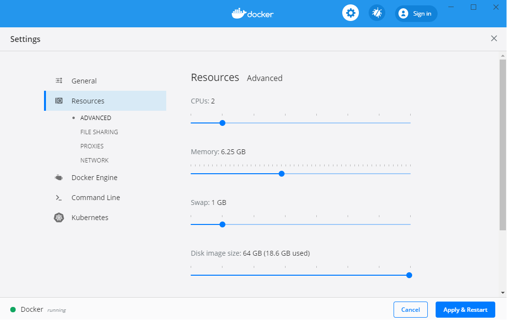

>**IMPORTANT:** If you are using *Docker Desktop WSL 2 backend* then you don't need to do any manual configuration mentioned in the above step. It automatically uses the required CPU and memory resources while building and running containers. For more details refer : [Docker Desktop WSL 2 backend](https://docs.docker.com/docker-for-windows/wsl/)

### Shared drives

This step is optional but recommended, as Docker sometimes needs to access the shared drives when building, depending on the build actions.

This is not really necessary when building from the CLI, but it's mandatory when building from Visual Studio to access the code to build.

The drive you'll need to share depends on where you place your source code. For e.g :

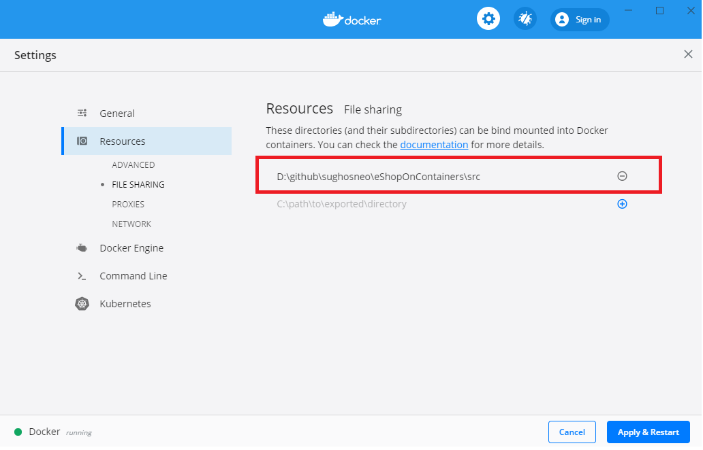

>**IMPORTANT:** If you are using *Docker Desktop WSL 2 backend*, then this step is optional.

## Configure local networking

IMPORTANT: Ports **5100** to **5205** must be open in the local Firewall, so authentication to the STS (Security Token Service container, based on IdentityServer) can be done through the 10.0.75.1 IP, which should be available and already setup by Docker. These ports are also needed for client remote apps like Xamarin app or SPA app in a remote browser.

You can manually create a rule in your local firewall in your development machine or you can just run the **add-firewall-rules-for-sts-auth-thru-docker.ps1** script available in the solution's **`deploy\windows\`** folder.


**NOTE:** If you get the error **Unable to obtain configuration from: `http://10.0.75.1:5105/.well-known/openid-configuration`** you might need to allow the program `vpnkit` for connections to and from any computer through all ports.

If you are working within a corporate VPN you might need to run this power shell command every time you power up your machine, to allow access from the `DockerNAT` network:

```powershell
Get-NetConnectionProfile | Where-Object { $_.InterfaceAlias -match "(DockerNAT)" } | ForEach-Object { Set-NetConnectionProfile -InterfaceIndex $_.InterfaceIndex -NetworkCategory Private }
```
Or just run the **set-dockernat-networkategory-to-private.ps1** script available in the solution's **deploy/windows** folder.

> **Docker Desktop 2.2.0.0 doesn't use `DokerNAT` so the above solution will not work.**
>
>**According to [issue 5538 in the Docker Desktop for Windows repo](https://github.com/docker/for-win/issues/5538) this was by-design.**
>
>**While it gets solved or a workaround devised, it's recommended that you use the `WebSPA` client.**

## Build and deploy eShopOnContainers

At this point you should be able to run eShopOnContainers from the command line. To do that, you should:

### 1. Create a folder for your repositories

Go to a directory to clone the repo, something like `C:\Users\<username>\source` will be fine.

### 2. Clone [eShopOnContainer's GitHub repo](https://github.com/dotnet-architecture/eShopOnContainers)

```console
git clone https://github.com/dotnet-architecture/eShopOnContainers.git
```

**Note:** Remember that the active development is done in `dev` branch. To test the latest code, use this branch instead of `master`.

### 3. Build the application

```console
cd eShopOnContainers\src
docker-compose build
```

While building the docker images, you should see something like the following image, and the process should take between 10 and 30 minutes to complete, depending on the system speed.


The first time you run this command it'll take some more additional time as it needs to pull/download the dotnet/core/aspnet and SDK images, so it'll take its time.

### 4. Deploy to the local Docker host

```console
docker-compose up
```

You should view something like this in the first seconds:

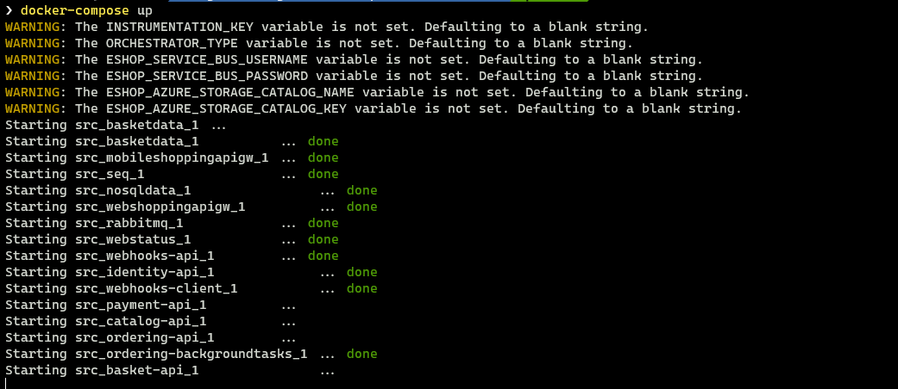

After a few more seconds you should see something like this:

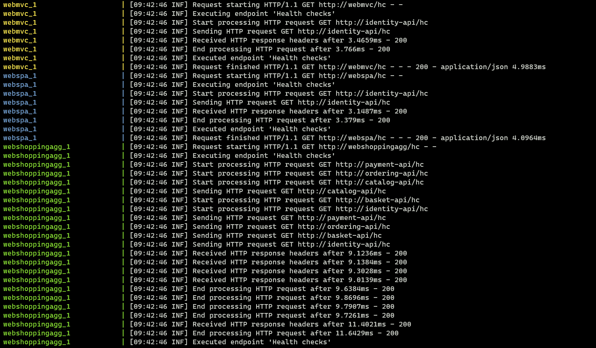

At this point you should be able to navigate to <http://host.docker.internal:5107/> and see the WebStatus microservice:

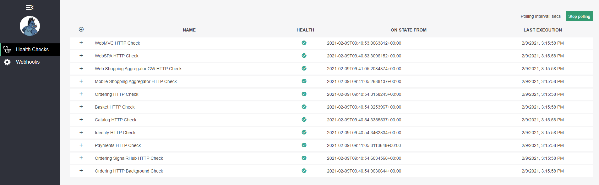

When all microservices are up (green checks) you should be able to navigate to <http://host.docker.internal:5100/> and see the Home Page of eShopOnContainers:

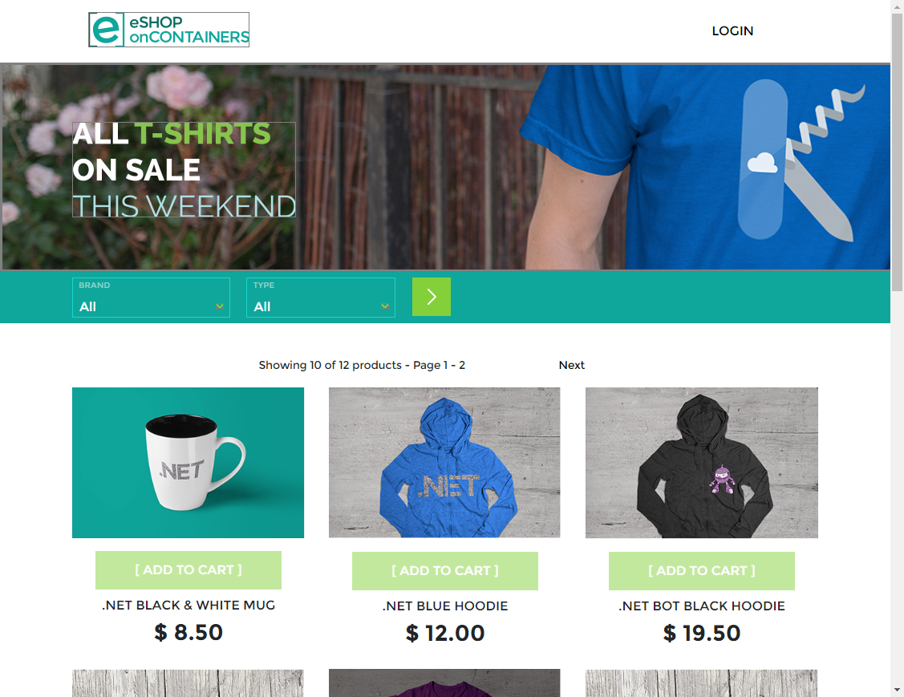

You should also be able to navigate to <http://host.docker.internal:5104/> and see the Home Page of eShopOnContainers on the SPA application:

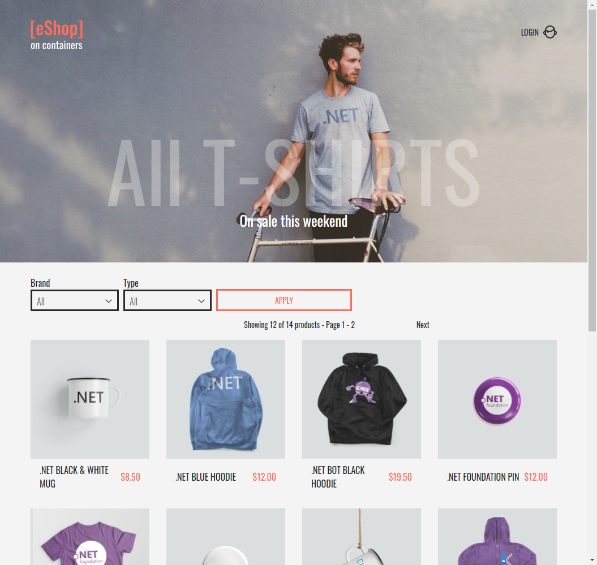

## Explore the application

You can now [explore the application](Explore-the-application) or continue with the optional Visual Studio setup.

## Optional - Use Visual Studio

If you want to explore the code and debug the application to see it working, you have to install Visual Studio.

You have to install at least VS 2019 (16.8 or later) and you can install the latest release from https://visualstudio.microsoft.com/vs/.

**Make sure you have the latest .NET 5 SDK from <https://dotnet.microsoft.com/download/dotnet/5.0> installed.**

Upon running the installer, select the following workloads depending on the apps you intend to test or work with:

### Server side (Microservices and web applications) - Workloads

- .NET cross-platform development
- Azure development (Optional) - It is optional but recommended in case you want to deploy to Docker hosts in Azure or use any other infrastructure in Azure.

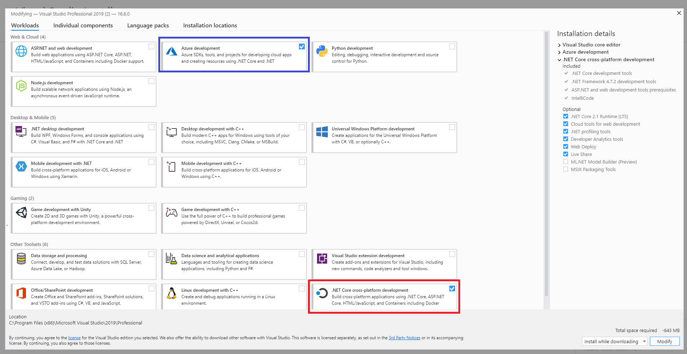

### Mobile (Xamarin apps for iOS, Android and Windows UWP) - Workloads

If you also want to test/work with the eShopOnContainer model app based on Xamarin, you need to install the following additional workloads:

- Mobile development with .NET (Xamarin)
- Universal Windows Platform development
- .NET desktop development (Optional) - This is not required, but just in case you also want to make tests consuming the microservices from WPF or WinForms desktop apps

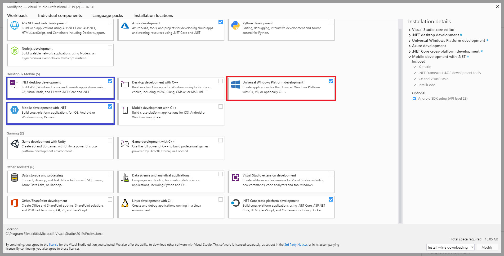

IMPORTANT: As mentioned above, make sure you are NOT installing Google's Android emulator with Intel HAXM hypervisor or you will run on an incompatibility and Hyper-V won't work in your machine, therefore, Docker for Windows won't work when trying to run the Linux host or any host with Hyper-V.

Make sure that you DO NOT select the highlighted options below with red arrows:


### Stop Docker background tasks on project open

VS runs some docker related tasks when opening a project with Docker support, to avoid these tasks from executing and slowing down your system, you might want to configure this options:

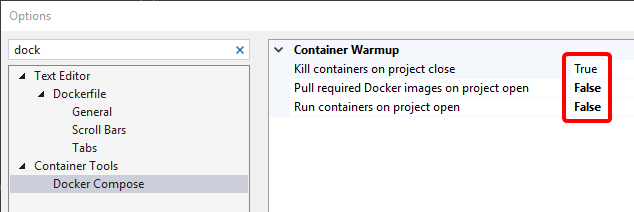

### Open eShopOnContainers solution in Visual Studio

- If testing/working only with the server-side applications and services, open the solution: **eShopOnContainers-ServicesAndWebApps.sln** (Recommended for most cases testing the containers and web apps)

- If testing/working either with the server-side applications and services plus the Xamarin mobile apps, open the solution: **eShopOnContainers.sln**

Below you can see the full **eShopOnContainers-ServicesAndWebApps.sln** solution (server side) opened in Visual Studio 2019:


Note how VS 2019 loads the `docker-compose.yml` files in a special node-tree so it uses that configuration to deploy/debug all the containers configured, at the same time into your Docker host.

### Build and run the application with F5 or Ctrl+F5

#### Set docker-compose as the default StartUp project

**IMPORTANT**: If the **"docker-compose" project** is not your "by default startup project", right click on the "docker-compose" node and select the "Set as Startup Project" menu option, as shown below:

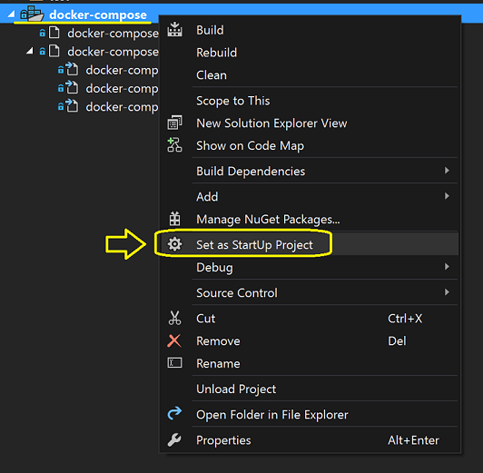

At this point, after waiting sometime for the NuGet packages to be properly restored, you should be able to build the whole solution or even directly deploy/debug it into Docker by simple hitting F5 or pressing the debug "Play" button that now should be labeled as "Docker": 

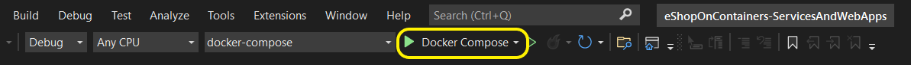

VS 2019 should compile the .NET projects, then create the Docker images and finally deploy the containers in the Docker host (your by default Linux VM in Docker for Windows). 
Note that the first time you hit F5 it'll take more time, a few minutes at least, because in addition to compile your bits, it needs to pull/download the base images (SQL for Linux Docker Image, Redis Image, ASPNET image, etc.) and register them in the local image repo of your PC. The next time you hit F5 it'll be much faster.

Finally, because the docker-compose configuration project is configured to open the MVC application, it should open your by default browser and show the MVC application with data coming from the microservices/containers:

**NOTE: Depending on your system configuration, starting up all containers and applying database migrations might take some time. If you get a 503 error (service unavailable) in the browser, just give it some more time and refresh, after little while you should get to see the home page.**

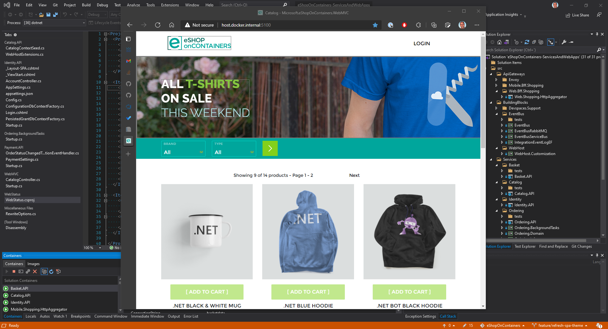

Here's how the docker-compose configuration project is configured to open the MVC application:

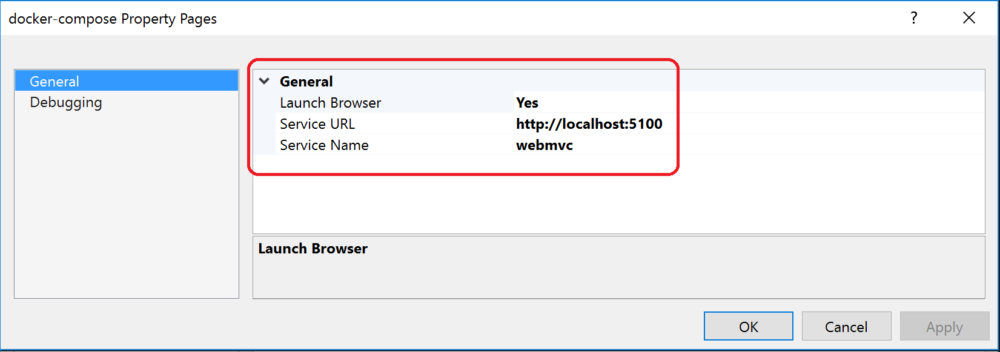

Finally, you can check out how the multiple containers are running in your Docker host by running the command **"docker ps"** like below:


You can see the 8 containers are running and what ports are being exposed, etc.

#### Debug with several breakpoints across the multiple containers/projects

Something very compelling and productive in VS 2019 is the capability to debug several breakpoints across the multiple containers/projects.
For instance, you could set a breakpoint in a controller within the MVC web app plus a second breakpoint in a second controller within the Catalog Web API microservice, then refresh the browser if you were still running the app or F5 again, and VS will be stopping within your microservices running in Docker as shown below! :)

Breakpoint at the MVC app running as Docker container in the Docker host:


Press F5 again...

Breakpoint at the Catalog microservice running as Docker container in the Docker host:


And that's it! Super simple! Visual Studio is handling all the complexities under the covers and you can directly do F5 and debug a multi-container application!

### Issue with "Visual Studio 2019 Tools for Docker" and network proxies/firewalls

After installing VS2019 with docker support, if you cannot debug properly and you are trying from a corporate network behind a proxy, consider  the following issue and workarounds, until this issue is fixed in Visual Studio:

- https://github.com/dotnet-architecture/eShopOnContainers/issues/224#issuecomment-319462344

## Optional - Use Visual Studio Code

After installing VS code from <a href='https://code.visualstudio.com/'>Visual Studio Code</a> you can edit particular file or "open" the whole solution folder like in the following screenshots:

`Opening the Solution's folder`


`Editing a .yml file`

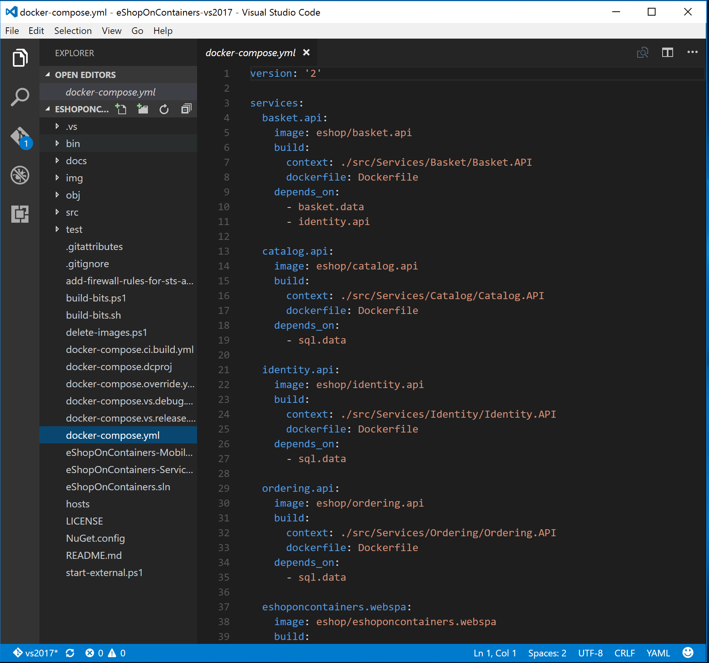

It is also recommended to install the C# extension and the Docker extension for VS Code:


## Explore the code

You should be now ready to begin learning by [exploring the code](Explore-the-code) and debugging eShopOnContainers.

## Additional resources

- **[eShopOnContainers issue] Can't display login page on MVC app** \
  <https://github.com/dotnet-architecture/eShopOnContainers/issues/295#issuecomment-327973650>
  
- **[docs.microsoft.com issue] Configuring Windows vEthernet Adapter Networks to Properly Support Docker Container Volumes** \
  <https://github.com/dotnet/docs/issues/11528#issuecomment-486662817>

- **[eShopOnContainers PR] Add Power Shell script to set network category to private for DockerNAT** \
  <https://github.com/dotnet-architecture/eShopOnContainers/pull/1019>

- **Troubleshoot Visual Studio development with Docker (Networking)** \
  <https://docs.microsoft.com/en-us/visualstudio/containers/troubleshooting-docker-errors?view=vs-2019#errors-specific-to-networking-when-debugging-your-application>
  
- **[eShopOnContainers issue] Projects won't load in VS2019** \
  https://github.com/dotnet-architecture/eShopOnContainers/issues/1013#issuecomment-488664792
