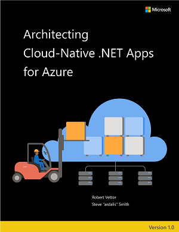
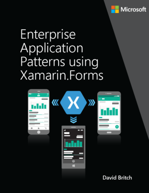

While developing this reference application, we also created the following companion **Reference Guides/eBooks**:

| Architecting Cloud-Native |   |
|---------------------------|---|
| | <ul><li><a href='https://dotnet.microsoft.com/download/e-book/cloud-native-azure/pdf'>**Download PDF** (v1.0.2 Edition)</a></li><li><a href="https://docs.microsoft.com/dotnet/architecture/cloud-native/">Read online</a></li><li><a href="Cloud-Native-eBook-changelog">Changelog</a></li></ul> |

| Microservices Architecture |   |
|---------------------------|---|
|  | <ul><li><a href='https://aka.ms/microservicesebook'>**Download PDF** (v5.0 Edition)</a></li><li><a href="https://docs.microsoft.com/dotnet/standard/microservices-architecture/">Read online</a></li><li><a href="Microservices-Architecture-eBook-changelog">Changelog</a></li></ul> |

| Containers Lifecycle & CI/CD |   |
|------------------------------|---|
|  | <ul><li><a href='https://aka.ms/dockerlifecycleebook'>**Download PDF** (v5.0.1 Edition)</a></li><li><a href="https://docs.microsoft.com/dotnet/standard/containerized-lifecycle-architecture/">Read online</a></li><li><a href="Microservices-DevOps-eBook-changelog">Changelog</a></li></ul> |

| App patterns with Xamarin.Forms |   |
|---------------------------------|---|
|  | <ul><li><a href='https://aka.ms/xamarinpatternsebook'>**Download PDF** </a></li><li><a href="https://docs.microsoft.com/en-us/xamarin/xamarin-forms/enterprise-application-patterns/">Read online</a></li></ul> |

 

###  Additional Resources

- [eshopOnContainers - Wiki](https://github.com/dotnet-architecture/eShopOnContainers/wiki)

- [.NET application architecture guide](https://docs.microsoft.com/dotnet/architecture/)

- [Create and deploy a cloud-native ASP.NET Core microservice](https://docs.microsoft.com/learn/modules/microservices-aspnet-core/)

- [Implement resiliency in a cloud-native ASP.NET Core microservice](https://docs.microsoft.com/learn/modules/microservices-resiliency-aspnet-core/)

