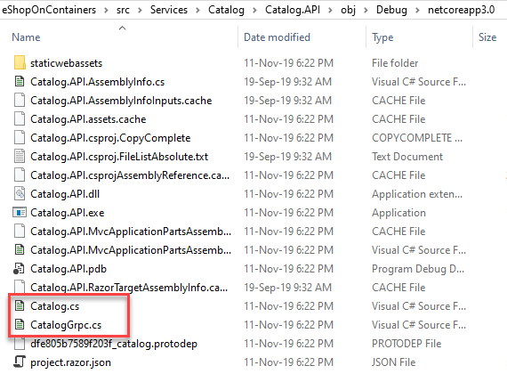

# gRPC

One of the big news on netcore 3.0 is the native support for gRPC. eShopOnContainers makes use of gRPC for internal microservice-to-microservice synchronous communication. Note that, in eShop most of the communication between microservices is decoupled and asynchronous using an Event Bus (we support RabbitMQ or Azure Service Bus).

gRPC is a high-perfomance communication protocol, based on HTTP/2 and protocol buffers. It should be the primary choice for direct communication between services (as oposed to other protocols like AMQP used for decoupled communication like queues or pub/sub).

Its benefits over using directly HTTP with JSON are:

* Protocol buffers are a binary, high-perfomance serialization mechanism. Depending on the language implementation protocol buffers can be up to 8x faster than JSON serialization while the messages can be around 60%-80% smaller.
* Supports streaming of data
* Contract between service and client is explicit (by using _proto_ files)

## gRPC usage in eShopOnContainers

In current implementation use of gRPC is limited to the communication between aggregators and micro services. We have following synchronous communications between services in eShop:

1. External clients (i. e. Xamarin App or Browser) to Api Gateways (BFFs): Use HTTP/REST
2. From BFFs to Aggregators: Use HTTP/REST
    * This is basically a request forward. Based on route request is forwarded from the BFF to the aggregator. This is performed for "logically complex" requests, when a single client call involves various microservices that are coordinated from the aggregator.
3. From BFFs to microservices: Use HTTP/REST
    * This is basically a request forward. Based on route request is forwarded from the BFF to the internal microservice. This is performed for simple CRUD requests.
4. From Aggregators to microservices: Use gRPC

Currently we are not transcoding from gRPC to HTTP/REST. This would allow use gRPC from the BFFs to both aggregators and microservices while keeping a HTTP/REST interfaceto the clients. This gRPC<->HTTP/REST translation could be done at BFF level.

Following microservices expose gRPC endpoints:

* Ordering API
* Catalog API
* Basket API

And following BFFs are gRPC clients:

* Mobile Shopping
* Web Shopping

## gRPC implementation in eShopOnContainers

gRPC is language agnostic: all services are defined using _proto_ files (usually with the `.proto` extension). These files are based on the [protobuffer language](https://developers.google.com/protocol-buffers/docs/proto), and define the interface of the service. Based on the _proto_ file, a code for creating the server and the client can be generated for every language. The canonical tool is _protoc_ which supports generate C# code.

Starting from netcore3, gRPC is deeply integrated in both, the tooling and the framework, to make the experience of using gRPC as seamless as possible.

### Generating server or client stubs from proto file in Net Core 3

The tooling, integrated in msbuild (so it can be used by Visual Studio but also by the `dotnet build` SDK command), allows the generation of the code needed to create a gRPC server or client based on a _proto_ file. The _proto_ file has to be referenced in the `csproj` using a `<ProtoBuf>` tag (inside a `<ItemGroup>`):

```xml
  <ItemGroup>
    <Protobuf Include="Protos\catalog.proto" GrpcServices="Client" />
  </ItemGroup>
```

The `GrpcServices` attributes is for specifying if a `Server` stub has to be generated, or a `Client` one.

>**Note** You can include as many `<Protobuf>` tags as you need. 

When you compile the code (either by running _Build_ from Visual Studio or `dotnet build`) all code will be generated and placed in the `obj` folder. This is intentionally: this code should never be in the source control repository.



### Creating the gRPC server

The server stub generated code, defines an abstract base class with a set of abstract methods, that you have to implement. You will have one abstract method for every rpc method defined in the _proto_ file.

So, given a _proto_ file that define the following methods:

```
service Catalog {
  rpc GetItemById (CatalogItemRequest) returns (CatalogItemResponse) {}
  rpc GetItemsByIds (CatalogItemsRequest) returns (PaginatedItemsResponse) {} 
```

A `CatalogBase` abstract class will be generated:

```cs
public class CatalogService : CatalogBase
{
    public CatalogService()
    {
    }

    public override async Task<CatalogItemResponse> GetItemById(CatalogItemRequest request, ServerCallContext context)
    {
        // Code
    }

    public override async Task<PaginatedItemsResponse> GetItemsByIds(CatalogItemsRequest request, ServerCallContext context)
    {
        // Code
    }
}
```

All needed C# types for parameters and return values will be generated automatically.

### Adding the gRPC pipeline into ASP.NET Core

ASP.NET Core supports direct integration of the gRPC pipeline. Only need to use the method `MapGrpcService` of the `IEndpointRouteBuilder` in your `Startup` class:

```cs
app.UseEndpoints(endpoints =>
{
    endpoints.MapDefaultControllerRoute();
    endpoints.MapControllers();
    endpoints.MapGrpcService<CatalogService>();
});
```

### Creating the gRPC client

If you are creating a gRPC client instead of a server, you need to create a `GrpChannel` and then a gRPC client using this channel:

```cs
var channel = GrpcChannel.ForAddress(UrlOfService);
var client = new Basket.BasketClient(channel);
```

The class `Basket.BasketClient` is the stub generated from the _proto_ file. Then you can call the methods of the `BasketClient` class.

### Using gRPC without TLS

gRPC works with HTTP/2 only. Usually when a client connects to a server, the connection is done using HTTP1.1 and promoted to HTTP/2 only if both, server and client, support HTTP/2. This promotion is performed using a protocol negotiation, usually implemented using ALPN protocol which requires TLS.

**That means, that by default, you need to have a TLS endpoint enabled to be able to use gRPC.**

However in internal microservices, maybe you don't have a TLS enabled endpoints (because those endpoints are internal). In this case you have two options:

* Open a single Kestrel endpoint, listening on HTTP/2
* Open two Kestrel endpoints, one listening on HTTP1.1 the other listening on HTTP/2

The second option is the one needed if your server must support HTTP1.1 clients other than gRPC clients. Following C# code (in `Program.cs`) shows the second approach:

```cs
WebHost.CreateDefaultBuilder(args)
    .ConfigureKestrel(options =>
    {
        options.Listen(IPAddress.Any, ports.httpPort, listenOptions =>
        {
            listenOptions.Protocols = HttpProtocols.Http1AndHttp2;
        });
        options.Listen(IPAddress.Any, ports.grpcPort, listenOptions =>
        {
            listenOptions.Protocols = HttpProtocols.Http2;
        });

    })
```

But, this is not enough. We need to tell the gRPC client, that can connect directly to a HTTP/2 endpoint, without the need to have TLS. By default netcore don't allow a gRPC client connect to a non-TLS endpoint.

Following lines are needed on the client:

```cs
AppContext.SetSwitch("System.Net.Http.SocketsHttpHandler.Http2UnencryptedSupport", true);
AppContext.SetSwitch("System.Net.Http.SocketsHttpHandler.Http2Support", true);
```

Those settings could be set only once at the beginning of the client.

## More information

* [gRPC](https://grpc.io/)
* [Introduction to gRPC services](https://docs.microsoft.com/en-us/aspnet/core/grpc/?view=aspnetcore-3.0)